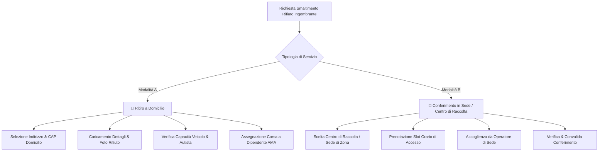
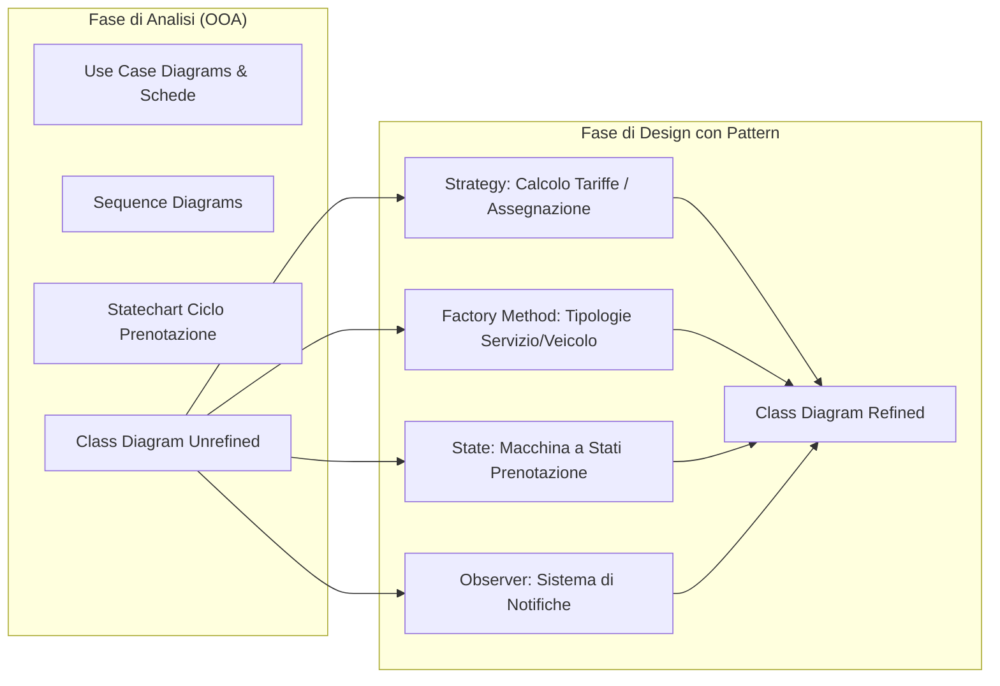

# 💡 Documento di Visione ed Esplorazione del Dominio: `MyAma`

> **Documento Informativo di Presentazione dell'Idea Progettuale**  
> *Riadattamento e trasposizione del dominio "MyAma" per il progetto di Ingegneria del Software (A.A. 2025/2026).*

---

## 🎯 1. Cos'è "MyAma" e Qual è la sua Visione?

**MyAma** è una piattaforma digitale pensata per modernizzare, centralizzare e ottimizzare il servizio di **raccolta, gestione e smaltimento dei rifiuti urbani ingombranti e speciali** per la città di Roma (in sinergia con i servizi offerti da AMA Roma S.p.A.).

Il sistema nasce con un duplice obiettivo:
1. **Per i Cittadini (Clienti)**: Offrire un canale digitale semplice, trasparente e immediato per prenotare il ritiro a domicilio o il conferimento programmato presso i Centri di Raccolta (isole ecologiche), riducendo la burocrazia, evitando file e contrastando il fenomeno dell'abbandono abusivo dei rifiuti sulle strade.
2. **Per l'Azienda (AMA - Operatori e Dirigenza)**: Fornire uno strumento centralizzato per la pianificazione dei turni, l'assegnazione automatica/manuale delle corse e dei mezzi, il monitoraggio della capacità di carico dei veicoli e la tracciabilità completa di ogni singola richiesta.

---

## 🛑 2. Il Problem Statement: Quale Problema Risolve?

Nel contesto attuale, la gestione dei rifiuti ingombranti soffre di diverse criticità:
- **Centralini telefonici e canali tradizionali congestionati**, con lunghi tempi di attesa per i cittadini.
- **Mancanza di integrazione in tempo reale** tra la richiesta del cittadino, la disponibilità effettiva dei veicoli idonei (in termini di volume e peso massimo trasportabile) e i turni di lavoro degli operatori.
- **Difficoltà di stima preventiva del carico**: i cittadini faticano a descrivere il volume o la natura del rifiuto, portando all'invio di mezzi inadeguati o al rifiuto del carico in loco.
- **Frammentazione operativa**: gestione interna spesso affidata a strumenti eterogenei (fogli di calcolo, comunicazioni telefoniche non tracciate).

**MyAma risolve queste inefficienze** introducendo un flusso completamente digitalizzato: dall'identificazione del rifiuto (con supporto a foto e categorizzazione), alla verifica automatica dei CAP serviti dalle sedi zonali, fino all'assegnazione ottimizzata del personale e alla rendicontazione post-servizio.

---

## 🔄 3. I Due Servizi Cardine Offerti dalla Piattaforma

MyAma struttura l'erogazione del servizio su due macro-modalità:

### A. Ritiro a Domicilio (*Door-to-Door*)
- Il cittadino richiede il prelievo del rifiuto presso il proprio numero civico.
- Il sistema verifica che il CAP sia coperto da una sede AMA operativa e calcola il preventivo di spesa (se applicabile).
- La richiesta viene assegnata a un **Autista AMA** dotato di un **Veicolo** con capacità di carico residua sufficiente nella fascia oraria selezionata.

### B. Conferimento Diretto in Sede (*Drop-off presso Centro di Raccolta*)
- Il cittadino sceglie di trasportare autonomamente il rifiuto presso una sede fisica / isola ecologica.
- Il sistema permette di prenotare una fascia oraria specifica per contingentare gli accessi ed eliminare le code.
- All'arrivo, l'**Operatore di Sede** verifica la prenotazione, ispeziona il rifiuto e convalida lo scarico.

---

## 👥 4. Gli Attori del Sistema (Classi di Utenza)

Il sistema prevede ruoli ben definiti con privilegi e viste dedicate:

| Attore | Descrizione e Ruolo | Azioni Principali nel Sistema |
|---|---|---|
| 👤 **Cittadino (Cliente)** | Utente privato o rappresentante di condominio. | • Accesso sicuro (credenziali / SPID) • Creazione/modifica/annullamento prenotazioni • Upload foto e specifiche del rifiuto • Tracciamento stato della richiesta • Rilascio di recensione/valutazione (1-5 stelle) |
| 🚛 **Autista AMA (Lavoratore)** | Dipendente operativo addetto ai ritiri su strada. | • Consultazione itinerario giornaliero e fermate assegnate • Verifica peso/volume assegnato al proprio mezzo • Registrazione esito del ritiro (completato / non ritirato / anomalia) |
| 🧑‍💼 **Operatore di Sede (Lavoratore)** | Dipendente operativo presso l'isola ecologica/sede fisica. | • Controllo accessi cittadini allo sportello • Convalida della conformità del rifiuto conferito • Chiusura operativa della prenotazione in loco |
| ⚙️ **Amministratore / Responsabile Logistica** | Personale direzionale e di gestione operativa AMA. | • Gestione anagrafiche sedi, zone (CAP) e veicoli (stato, carico max) • Configurazione turni, orari e categorie di rifiuto/tariffe • Monitoraggio metriche di servizio e reportistica |

---

## ⚙️ 5. Regole di Business e Vincoli di Dominio Chiave

Per rendere la modellazione realistica e rigorosa, MyAma incorpora regole di business precise:

1. **Competenza Territoriale (CAP $\leftrightarrow$ Sede)**: Ciascuna sede AMA ha competenza su un insieme definito di CAP. Una richiesta può essere presa in carico solo da una sede che copre la zona del richiedente.
2. **Capacità di Carico del Veicolo**: Ogni mezzo ha una portata massima (in kg o metri cubi). Il sistema garantisce che la somma dei pesi stimati dei ritiri assegnati a un veicolo per un determinato turno non superi la capacità massima:
   $$\sum_{i=1}^{n} \text{PesoRifiuto}_i \le \text{CaricoMassimo}_{\text{Veicolo}}$$
3. **Pianificazione Temporale & Disdetta**: Una prenotazione può essere modificata o annullata dal cittadino con un anticipo minimo (es. fino a 2 ore prima dell'orario stabilito).
4. **Ciclo di Vita della Prenotazione**: La prenotazione attraversa stati ben determinati:
   $$\text{Creata} \longrightarrow \text{Assegnata} \longrightarrow \text{In Corso} \longrightarrow \text{Completata} \quad (\text{oppure } \text{Annullata} / \text{Rifiutata})$$
5. **Qualità e Feedback**: Solo a servizio concluso (*Completata*), il cliente è abilitato a esprimere una valutazione con voto numerico e commento testuale.

---

## 🚀 6. Perché MyAma è Perfetto per il Progetto di Ingegneria del Software?

Il passaggio dal vecchio elaborato di Basi di Dati al progetto d'esame di **Ingegneria del Software** consente di valorizzare appieno il dominio di MyAma, che si presta naturalmente all'applicazione di tutti i modelli richiesti dal docente:

### 🧩 Opportunità Ideali per i Design Pattern (Appendice):
1. **Strategy Pattern**:
   - *Algoritmo di calcolo del costo/tariffa di smaltimento* (es. tariffa standard, tariffa per rifiuti speciali RAEE, tariffa agevolata per fasce ISEE).
   - *Algoritmo di assegnazione automatica veicolo/autista* (es. strategia Nearest First vs Best Load Balance).
2. **Factory Method / Abstract Factory Pattern**:
   - Creazione polimorfica delle istanze di servizio (`RitiroDomicilioService` vs `ConferimentoSedeService`) e configurazione delle relative regole.
3. **State Pattern**:
   - Modellazione dell'oggetto `Prenotazione` che modifica i propri comportamenti e permessi in base allo stato corrente (`BozzaState`, `AssegnataState`, `InLavorazioneState`, `CompletataState`, `AnnullataState`).
4. **Observer Pattern**:
   - Meccanismo di notifica asincrono verso il cittadino (email/SMS/notifica push) e verso i tablet degli autisti/operatori ad ogni avanzamento di stato della prenotazione.

---

## 📊 7. Confronto: Progetto Basi di Dati vs Progetto Ingegneria del Software

| Aspetto | Progetto Basi di Dati (`MYAMABASIDATI`) | Progetto Ingegneria del Software (`PROGETTOISW`) |
|---|---|---|
| **Obiettivo Principale** | Progettare la persistenza, normalizzare lo schema relazionale (1NF, 2NF, 3NF), scrivere query SQL e vincoli di integrità referenziale. | Definire i requisiti utente formali (IEEE 830), analizzare il dominio con OOA (UML) e progettare un'architettura software estendibile tramite Design Pattern. |
| **Artefatti Prodotti** | Schema E-R concettuale, Schema logico-relazionale, tabelle SQL, indici e carico transazionale. | Use Case Diagrams con scenari dettagliati, Sequence Diagrams, State Machines, Class Diagram Unrefined $\rightarrow$ Refined, Appendice Design Pattern. |
| **Tooling** | MySQL Workbench / Oracle / draw.io. | **Visual Paradigm** (modelli UML standard `.vpp`). |
| **Standard di Riferimento** | Regole di normalizzazione relazionale di Codd / Boyce-Codd. | **IEEE Std. 830-1998** (SRS), standard UML 2.x, catalogo GoF (*Gang of Four*). |

---

## 📌 Sintesi per il Team di Sviluppo

> **In sintesi**: `MyAma` non è solo un "gestionale per rifiuti", ma un ecosistema software completo che modella la logistica di un servizio pubblico essenziale. Il dominio è ricco di interazioni multi-attore, flussi asincroni e vincoli operativi, rappresentando il terreno ideale per produrre una specifica software (SRS) di eccellenza conforme a tutti i criteri di valutazione del Prof. D'Ambrogio.
