# 5. Modelli Architetturali del Sistema (OOA) — 5.1 Activity Diagrams

Il presente documento raccoglie, cataloga e descrive in modo analitico e dettagliato **tutti gli Activity Diagram** individuati nel repository del progetto **MyAma** (cartella `MYAMA/PROGETTOFINALE/ACTIVITY DIAGRAM/`).

I diagrammi di attività hanno lo scopo di modellare la **dinamica comportamentale dei processi di business**, evidenziando la sequenza temporale delle azioni, i punti di diramazione decisionale (*decision node*), le condizioni di guardia, i cicli di recupero errore e gli stati finali di completamento o interruzione (*activity final node*).

La struttura del documento è organizzata per **Attore / Ruolo Operativo**, ricalcando fedelmente l'impostazione dei progetti benchmark di riferimento (*Progetto Buongiorno Machowski*, *Progetto Hotel Mongelli*, *Progetto Pesca Cipolletta*).

---

## 📑 Indice Generale degli Activity Diagram

- [5.1.1 Utente non registrato e Utente di sistema](#511-utente-non-registrato-e-utente-di-sistema)
  - [AD-01: Registrarsi come cittadino](#ad-01-registrarsi-come-cittadino)
  - [AD-02: Registrarsi tramite codice di invito](#ad-02-registrarsi-tramite-codice-di-invito)
  - [AD-03: Effettuare accesso](#ad-03-effettuare-accesso)
- [5.1.2 Cittadino (Cliente)](#512-cittadino-cliente)
  - [AD-04: Richiedere ritiro a domicilio](#ad-04-richiedere-ritiro-a-domicilio)
  - [AD-05: Prenotare conferimento presso sede AMA](#ad-05-prenotare-conferimento-presso-sede-ama)
  - [AD-06: Visualizzare sedi compatibili](#ad-06-visualizzare-sedi-compatibili)
  - [AD-07: Visualizzare date e fasce orarie disponibili](#ad-07-visualizzare-date-e-fasce-orarie-disponibili)
  - [AD-08: Visualizzare prenotazioni attive](#ad-08-visualizzare-prenotazioni-attive)
  - [AD-09: Annullare prenotazione](#ad-09-annullare-prenotazione)
  - [AD-10: Visualizzare storico prenotazioni](#ad-10-visualizzare-storico-prenotazioni)
  - [AD-11: Valutare il servizio](#ad-11-valutare-il-servizio)
  - [AD-12: Contattare / Chiamare autista](#ad-12-contattare--chiamare-autista)
- [5.1.3 Autista AMA](#513-autista-ama)
  - [AD-13: Visualizzare ritiri assegnati / Consultare dettagli del ritiro](#ad-13-visualizzare-ritiri-assegnati--consultare-dettagli-del-ritiro)
  - [AD-14: Registrare esito del ritiro](#ad-14-registrare-esito-del-ritiro)
  - [AD-15: Chiamare cittadino](#ad-15-chiamare-cittadino)
- [5.1.4 Operatore di Sede AMA](#514-operatore-di-sede-ama)
  - [AD-16: Visualizzare prenotazioni della sede / Consultare dettagli](#ad-16-visualizzare-prenotazioni-della-sede--consultare-dettagli)
  - [AD-17: Verificare prenotazione del cittadino](#ad-17-verificare-prenotazione-del-cittadino)
  - [AD-18: Registrare esito del conferimento](#ad-18-registrare-esito-del-conferimento)
- [5.1.5 Amministratore di Sede AMA](#515-amministratore-di-sede-ama)
  - [AD-19: Generare codice di invito per il personale](#ad-19-generare-codice-di-invito-per-il-personale)
  - [AD-20: Gestire disponibilità dei lavoratori](#ad-20-gestire-disponibilit%C3%A0-dei-lavoratori)
  - [AD-21: Gestire disponibilità dei veicoli](#ad-21-gestire-disponibilit%C3%A0-dei-veicoli)
  - [AD-22: Gestire disponibilità della sede e fasce orarie](#ad-22-gestire-disponibilit%C3%A0-della-sede-e-fasce-orarie)
  - [AD-23: Gestire associazioni tra sede e zone/CAP](#ad-23-gestire-associazioni-tra-sede-e-zonecap)
  - [AD-24: Rimuovere lavoratori dalla sede](#ad-24-rimuovere-lavoratori-dalla-sede)
- [5.1.6 Amministratore Generale AMA](#516-amministratore-generale-ama)
  - [AD-25: Generare codice amministratore di sede](#ad-25-generare-codice-amministratore-di-sede)
  - [AD-26: Rimuovere amministratore di sede AMA](#ad-26-rimuovere-amministratore-di-sede-ama)

---

## 5.1.1 Utente non registrato e Utente di sistema

Questa sezione modella i flussi per l'accreditamento, la registrazione diretta o tramite invito e l'autenticazione all'interno del sistema MyAma.

---

### AD-01: Registrarsi come cittadino

- **Riferimento File Immagine**: [Registrarsi come cittadino.jpg](file:///c:/Users/Luca/Desktop/ISW/PROGETTOISW/MYAMA/PROGETTOFINALE/ACTIVITY%20DIAGRAM/FOTO%20ACTIVITY%20DIAGRAM%20SAMUELE/Utente%20non%20registrato%20-%20Utente%20di%20sistema/Registrarsi%20come%20cittadino.jpg)
- **Attore primario**: Utente non registrato
- **Contesto e Obiettivo**: Consentire a un cittadino di creare autonomamente il proprio account sulla piattaforma per poter successivamente richiedere ritiri e prenotare conferimenti.

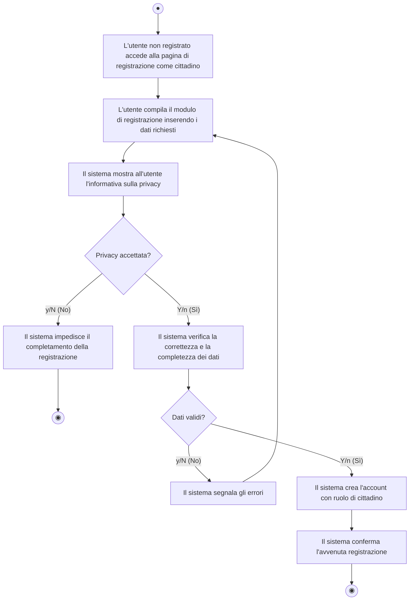

#### Descrizione del Flusso Operativo:
1. **Inizio**: L'utente non registrato accede all'interfaccia pubblica di registrazione come cittadino.
2. **Compilazione**: L'utente inserisce i propri dati anagrafici e di contatto (nome, cognome, codice fiscale, indirizzo, email, password).
3. **Consenso Privacy**: Il sistema sottopone l'informativa sul trattamento dei dati personali.
4. **Verifica Consenso**: Se l'utente rifiuta l'informativa (`[y/N]`), il sistema blocca il processo e termina senza salvare alcun dato.
5. **Validazione Dati**: Se la privacy è accettata (`[Y/n]`), il sistema esegue i controlli sintattici e semantici sui campi inseriti (es. unicità email/CF, robustezza password).
   - In caso di errori (`[y/N]`), il sistema segnala i campi non conformi e riporta l'utente alla schermata di compilazione.
6. **Creazione Account**: Se i dati sono corretti (`[Y/n]`), il sistema istanzia l'account con ruolo predefinito di `Cittadino`.
7. **Conclusione**: Viene visualizzato il messaggio di avvenuta registrazione e il flusso termina con successo.

---

### AD-02: Registrarsi tramite codice di invito

- **Riferimento File Immagine**: [Registrarsi tramite codice di invito.jpg](file:///c:/Users/Luca/Desktop/ISW/PROGETTOISW/MYAMA/PROGETTOFINALE/ACTIVITY%20DIAGRAM/FOTO%20ACTIVITY%20DIAGRAM%20SAMUELE/Utente%20non%20registrato%20-%20Utente%20di%20sistema/Registrarsi%20tramite%20codice%20di%20invito.jpg)
- **Attore primario**: Utente non registrato (Personale AMA / Amministratore incaricato)
- **Contesto e Obiettivo**: Consentire a un operatore, autista o amministratore in possesso di un token univoco (codice invito) di completare la registrazione aziendale associando il ruolo predefinito.

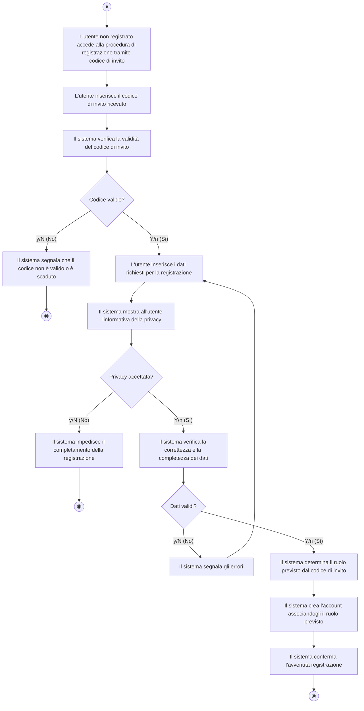

#### Descrizione del Flusso Operativo:
1. **Accesso con Token**: L'utente accede alla vista dedicata alla registrazione protetta da codice di invito e inserisce la stringa alfanumerica ricevuta.
2. **Validazione Token**: Il sistema interroga il repository codici verificando che il token esista, non sia scaduto e non sia già stato consumato.
   - Se non valido (`[y/N]`), viene notificato il fallimento e il flusso si arresta.
3. **Inserimento Anagrafica**: Con codice valido (`[Y/n]`), l'utente compila le credenziali e i dettagli personali.
4. **Privacy e Validazione Campi**: Come per il cittadino, viene richiesta l'accettazione della privacy e controllata la coerenza dei dati.
5. **Assegnazione Ruolo**: Il sistema ricava dal codice invito il ruolo associato (es. *Autista*, *Operatore di Sede*, *Amministratore di Sede*) e assegna i privilegi corrispondenti.
6. **Chiusura**: Viene emessa la notifica di successo e invalidato il codice invito per usi futuri.

---

### AD-03: Effettuare accesso

- **Riferimento File Immagine**: [Effettuare accesso.jpg](file:///c:/Users/Luca/Desktop/ISW/PROGETTOISW/MYAMA/PROGETTOFINALE/ACTIVITY%20DIAGRAM/FOTO%20ACTIVITY%20DIAGRAM%20SAMUELE/Utente%20non%20registrato%20-%20Utente%20di%20sistema/Effettuare%20accesso.jpg)
- **Attore primario**: Utente di sistema (qualsiasi utente registrato)
- **Contesto e Obiettivo**: Autenticare l'utente nel sistema, verificando le credenziali e instradandolo alla dashboard coerente con il proprio ruolo.

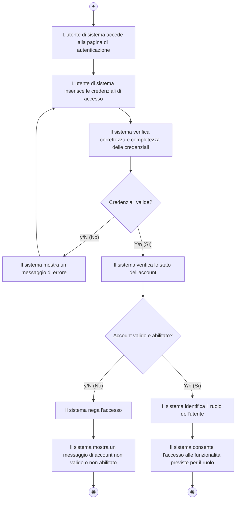

#### Descrizione del Flusso Operativo:
1. **Richiesta Login**: L'utente apre il form di autenticazione e inserisce identificativo (email/username) e password.
2. **Controllo Credenziali**: Il sistema verifica la corrispondenza delle credenziali con quelle memorizzate.
   - Se errate (`[y/N]`), mostra un avviso e consente un nuovo tentativo tornando all'inserimento.
3. **Verifica Stato Account**: Se le credenziali coincidono (`[Y/n]`), viene controllato lo stato operativo dell'utenza (es. account attivo, non sospeso o revocato).
   - Se non abilitato (`[y/N]`), l'accesso viene respinto con apposito messaggio bloccante.
4. **Instradamento Ruolo**: Con account valido (`[Y/n]`), viene identificato il ruolo (Cittadino, Autista, Operatore Sede, Admin Sede, Admin Generale) sbloccando le sole viste autorizzate.

---

## 5.1.2 Cittadino (Cliente)

Questa sezione comprende i casi d'uso che consentono al cittadino di usufruire dei servizi principali della piattaforma MyAma.

---

### AD-04: Richiedere ritiro a domicilio

- **Riferimento File Immagine**: [ActivityDiagramRichiestaRitiroDomicilio.jpg](file:///c:/Users/Luca/Desktop/ISW/PROGETTOISW/MYAMA/PROGETTOFINALE/ACTIVITY%20DIAGRAM/FOTO%20ACTIVITY%20DIAGRAM%20DAVIDE/ActivityDiagramRichiestaRitiroDomicilio.jpg)
- **Attore primario**: Cittadino (Cliente)
- **Contesto e Obiettivo**: Prenotare la raccolta a domicilio di rifiuti ingombranti, verificando disponibilità territoriali, risorse operative (veicoli con adeguata capacità di carico e autisti).

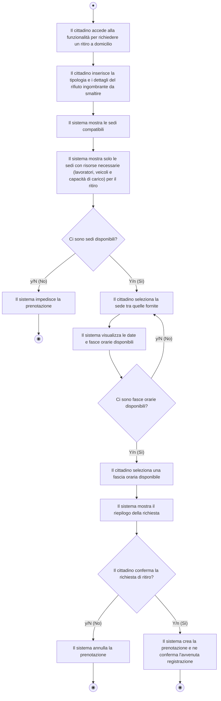

#### Descrizione del Flusso Operativo:
1. **Specifica Rifiuto**: Il cittadino compila la richiesta specificando tipologia, quantità/volume stimato e indirizzo/CAP di prelievo.
2. **Filtro Risorse Sedi**: Il sistema individua le sedi territorialmente competenti che possiedono veicoli con capacità di carico residua idonea e personale in turno.
   - Se non vi sono sedi disponibili (`[y/N]`), la procedura viene terminata con notifica.
3. **Selezione Sede e Slot**: Il cittadino sceglie una sede e visualizza il calendario degli slot.
   - Se la sede selezionata ha esaurito gli slot (`[y/N]`), il flusso torna alla selezione di un'altra sede compatibile.
4. **Riepilogo e Conferma**: Viene mostrato il riepilogo dettagliato della prenotazione con i dati del ritiro.
   - Se il cittadino annulla (`[y/N]`), la richiesta viene scartata.
   - Se conferma (`[Y/n]`), la prenotazione viene memorizzata in stato `Creata/Assegnata` e confermata all'utente.

---

### AD-05: Prenotare conferimento presso sede AMA

- **Riferimento File Immagine**: [ActivityDiagramRichiestaPrenotaConferimento.jpg](file:///c:/Users/Luca/Desktop/ISW/PROGETTOISW/MYAMA/PROGETTOFINALE/ACTIVITY%20DIAGRAM/FOTO%20ACTIVITY%20DIAGRAM%20DAVIDE/ActivityDiagramRichiestaPrenotaConferimento.jpg)
- **Attore primario**: Cittadino (Cliente)
- **Contesto e Obiettivo**: Programmare l'accesso autonomo presso un centro di raccolta (isola ecologica) per consegnare direttamente un rifiuto ingombrante o speciale.

```mermaid
flowchart TD
    Start((●)) --> A1["Il cittadino seleziona la funzionalità per prenotare il conferimento di un rifiuto presso una sede AMè]
    A1 --> A2["Il cittadino inserisce la tipologia e i dettagli del rifiuto da smaltire e carica una foto dello stesso"]
    A2 --> A3["Il sistema visualizza sedi compatibili"]
    A3 --> D1{"Ci sono sedi compatibili?"}
    D1 -- "y/N (No)" --> E1["Il sistema impedisce la prenotazione"]
    E1 --> End1((◉))
    D1 -- "Y/n (Sì)" --> A4["Seleziona sede compatibile"]
    A4 --> A5["Il sistema visualizza date e fasce orarie disponibili"]
    A5 --> D2{"Ci sono date e fasce orarie disponibili?"}
    D2 -- "y/N (No)" --> A4
    D2 -- "Y/n (Sì)" --> A6["Seleziona data e fascia oraria"]
    A6 --> A7["Il sistema mostra il riepilogo della richiesta"]
    A7 --> D3{"Il cittadino conferma il riepilogo?"}
    D3 -- "y/N (No)" --> E2["Il sistema annulla la prenotazione"]
    E2 --> End2((◉))
    D3 -- "Y/n (Sì)" --> A8["Il sistema crea la prenotazione e ne conferma l'avvenuta registrazione"]
    A8 --> End3((◉))
```

#### Descrizione del Flusso Operativo:
1. **Acquisizione Dettagli e Media**: Il cittadino indica categoria di rifiuto, descrizione e facoltativamente esegue l'upload di una foto per perizia visiva.
2. **Selezione Sede Compatibile**: Il sistema propone i centri di raccolta autorizzati per quel codice CER/rifiuto e compatibili con il CAP dell'utente.
3. **Scelta Slot Orario**: L'utente individua giorno e orario di accesso. Se lo slot risulta esaurito, può selezionare un'altra sede o un altro giorno.
4. **Finalizzazione**: A seguito della revisione del riepilogo, la conferma del cittadino genera la prenotazione di conferimento in sede.

---

### AD-06: Visualizzare sedi compatibili

- **Riferimento File Immagine**: [ActivityDiagramVisualizzareSediCompatibili.jpg](file:///c:/Users/Luca/Desktop/ISW/PROGETTOISW/MYAMA/PROGETTOFINALE/ACTIVITY%20DIAGRAM/FOTO%20ACTIVITY%20DIAGRAM%20DAVIDE/ActivityDiagramVisualizzareSediCompatibili.jpg)
- **Attore primario**: Cittadino (Cliente)
- **Contesto e Obiettivo**: Consultare in modo puntuale quali sedi e centri di raccolta AMA hanno competenza sul proprio CAP e possono accogliere la specifica tipologia di rifiuto.

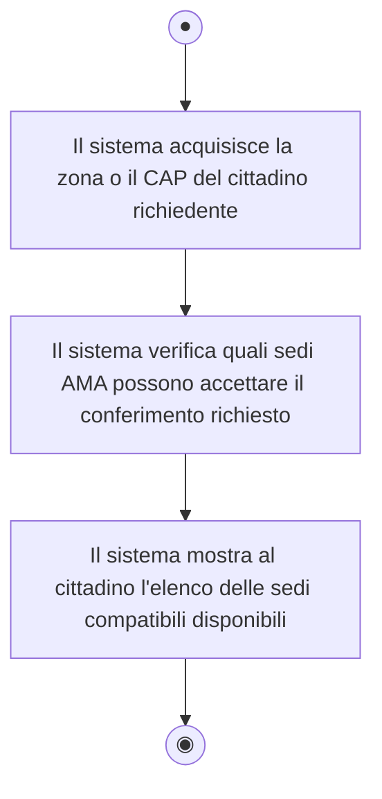

#### Descrizione del Flusso Operativo:
1. **Acquisizione Posizione**: Il sistema rileva o acquisisce la zona/CAP inserita dal cittadino.
2. **Filtro di Dominio**: Interroga l'archivio delle sedi verificando la copertura geografica e l'abilitazione allo smaltimento del rifiuto.
3. **Visualizzazione Elenco**: Restituisce all'interfaccia l'elenco delle sedi idonee con indirizzi e orari operativi.

---

### AD-07: Visualizzare date e fasce orarie disponibili

- **Riferimento File Immagine**: [ActivityDiagramVIsualizzareDataOraDisponibili.jpg](file:///c:/Users/Luca/Desktop/ISW/PROGETTOISW/MYAMA/PROGETTOFINALE/ACTIVITY%20DIAGRAM/FOTO%20ACTIVITY%20DIAGRAM%20DAVIDE/ActivityDiagramVIsualizzareDataOraDisponibili.jpg)
- **Attore primario**: Cittadino (Cliente)
- **Contesto e Obiettivo**: Verificare il calendario di apertura e la disponibilità di slot per una determinata sede prescelta.

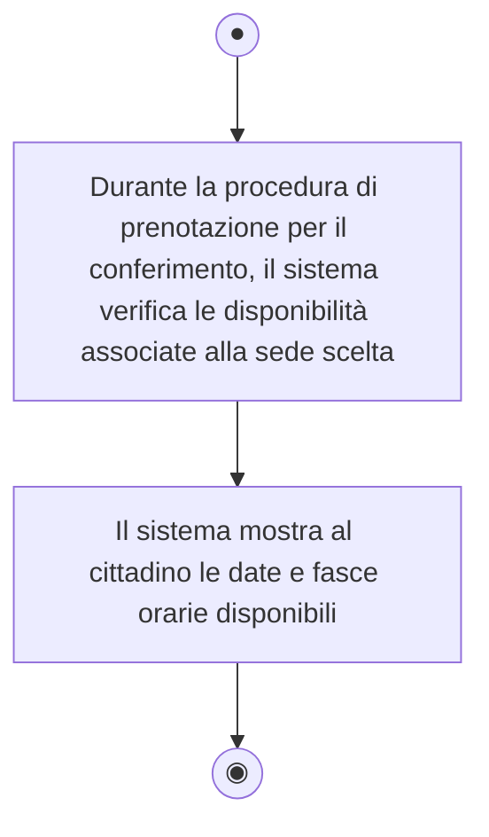

#### Descrizione del Flusso Operativo:
1. **Interrogazione Calendario**: Il sistema legge le fasce orarie attive per la sede selezionata e ne calcola la capienza residua sottraendo le prenotazioni già confermate.
2. **Presentazione Slot**: Vengono esposte all'utente solo le finestre orarie prenotabili.

---

### AD-08: Visualizzare prenotazioni attive

- **Riferimento File Immagine**: [ActivityDiagramVisualizzarePrenotazioniAttive.jpg](file:///c:/Users/Luca/Desktop/ISW/PROGETTOISW/MYAMA/PROGETTOFINALE/ACTIVITY%20DIAGRAM/FOTO%20ACTIVITY%20DIAGRAM%20DAVIDE/ActivityDiagramVisualizzarePrenotazioniAttive.jpg) *(con variante grafica [VisualizzaPrenotazioniAttive.jpg](file:///c:/Users/Luca/Desktop/ISW/PROGETTOISW/MYAMA/PROGETTOFINALE/ACTIVITY%20DIAGRAM/FOTO%20ACTIVITY%20DIAGRAM%20VALERIO/VisualizzaPrenotazioniAttive.jpg))*
- **Attore primario**: Cittadino (Cliente)
- **Contesto e Obiettivo**: Consultare lo stato delle richieste in corso (ritiri o conferimenti programmati) e visualizzarne i dettagli operativi.

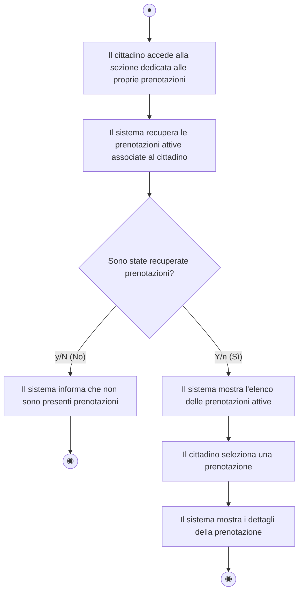

#### Descrizione del Flusso Operativo:
1. **Accesso Sezione**: Il cittadino autenticato apre la vista "Le mie prenotazioni".
2. **Recupero Record**: Il sistema estrae le prenotazioni con stato diverso da `Completata` o `Annullata`.
   - Se non vi sono record attivi (`[y/N]`), espone un messaggio informativo.
3. **Consultazione**: Con record presenti (`[Y/n]`), l'utente può selezionare un elemento per esaminare data, fascia oraria, tipologia rifiuto, sede/indirizzo e autista assegnato.

---

### AD-09: Annullare prenotazione

- **Riferimento File Immagine**: [ActivityDiagramAnnullarePrenotazione.jpg](file:///c:/Users/Luca/Desktop/ISW/PROGETTOISW/MYAMA/PROGETTOFINALE/ACTIVITY%20DIAGRAM/FOTO%20ACTIVITY%20DIAGRAM%20DAVIDE/ActivityDiagramAnnullarePrenotazione.jpg)
- **Attore primario**: Cittadino (Cliente)
- **Contesto e Obiettivo**: Disdire una prenotazione precedentemente effettuata, nel rispetto dei vincoli temporali di cancellazione consentiti dalle regole di dominio.

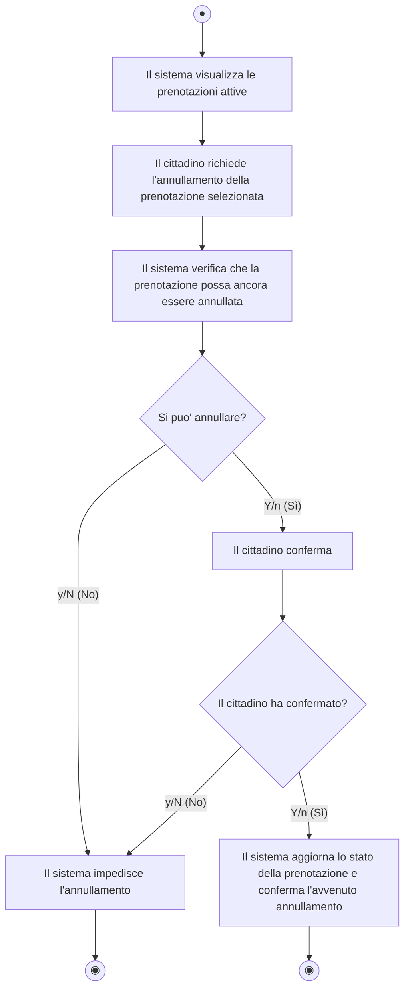

#### Descrizione del Flusso Operativo:
1. **Selezione e Richiesta**: Dalla lista delle prenotazioni attive, il cittadino invia la richiesta di revoca per una specifica voce.
2. **Verifica Vincoli Temporali**: Il sistema valuta le regole di business (es. preavviso minimo rispetto all'orario fissato).
   - Se la richiesta è fuori tempo limite o la corsa è già in esecuzione (`[y/N]`), l'annullamento viene negato.
3. **Conferma Utente**: Se revocabile (`[Y/n]`), viene chiesto un esplicito consenso all'utente.
4. **Aggiornamento Stato**: A fronte di conferma positiva, lo stato passa ad `Annullata`, liberando contestualmente lo slot o la capacità di carico del veicolo.

---

### AD-10: Visualizzare storico prenotazioni

- **Riferimento File Immagine**: [ActivityDiagramVisualizzareStoricoPrenotazioni.jpg](file:///c:/Users/Luca/Desktop/ISW/PROGETTOISW/MYAMA/PROGETTOFINALE/ACTIVITY%20DIAGRAM/FOTO%20ACTIVITY%20DIAGRAM%20DAVIDE/ActivityDiagramVisualizzareStoricoPrenotazioni.jpg)
- **Attore primario**: Cittadino (Cliente)
- **Contesto e Obiettivo**: Accedere all'archivio storico di tutte le operazioni concluse o annullate associate all'account.

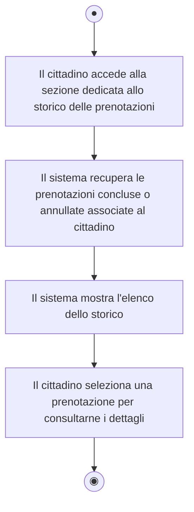

#### Descrizione del Flusso Operativo:
1. **Apertura Storico**: Il cittadino accede all'archivio storico.
2. **Filtro Completate/Annullate**: Il sistema seleziona gli eventi pregressi e ne presenta l'elenco ordinato cronologicamente.
3. **Dettaglio Singolo Servizio**: L'utente può aprire ciascuna scheda per visualizzare esito finale, operatore/autista che ha gestito il rifiuto e note di chiusura.

---

### AD-11: Valutare il servizio

- **Riferimento File Immagine**: [ActivityDiagramChiamareAutista.jpg](file:///c:/Users/Luca/Desktop/ISW/PROGETTOISW/MYAMA/PROGETTOFINALE/ACTIVITY%20DIAGRAM/FOTO%20ACTIVITY%20DIAGRAM%20DAVIDE/ActivityDiagramChiamareAutista.jpg)  
  *(Nota tecnica: nel repository locale l'immagine contenente il diagramma di Valutazione è salvata con il file name `ActivityDiagramChiamareAutista.jpg`).*
- **Attore primario**: Cittadino (Cliente)
- **Contesto e Obiettivo**: Rilasciare un feedback qualitativo (punteggio e recensione) su un servizio di ritiro o conferimento già concluso.

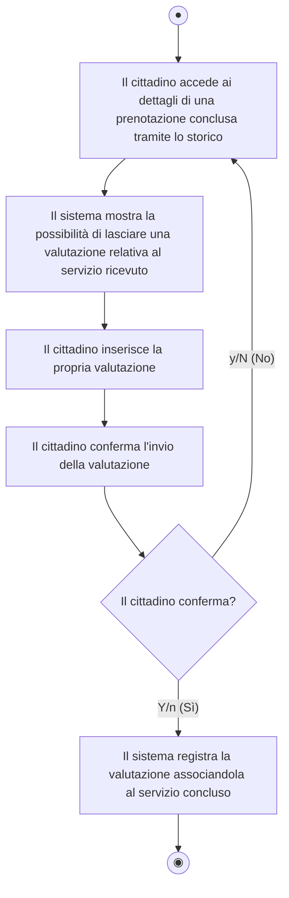

#### Descrizione del Flusso Operativo:
1. **Accesso da Storico**: Dalla scheda di un servizio con stato `Completato`, il sistema abilita la form di recensione.
2. **Compilazione Feedback**: L'utente indica il rating numerico e le osservazioni testuali.
3. **Conferma Invio**: Se l'utente decide di non confermare (`[y/N]`), torna alla vista di partenza senza salvare. Se conferma (`[Y/n]`), la valutazione viene registrata in modo persistente e collegata alla prenotazione.

---

### AD-12: Contattare / Chiamare autista

- **Riferimento File Immagine**: [ActivityDiagramValutareIlServizio.jpg](file:///c:/Users/Luca/Desktop/ISW/PROGETTOISW/MYAMA/PROGETTOFINALE/ACTIVITY%20DIAGRAM/FOTO%20ACTIVITY%20DIAGRAM%20DAVIDE/ActivityDiagramValutareIlServizio.jpg)  
  *(Nota tecnica: nel repository locale l'immagine contenente il diagramma Chiamata Autista è salvata con il file name `ActivityDiagramValutareIlServizio.jpg`).*
- **Attore primario**: Cittadino (Cliente)
- **Contesto e Obiettivo**: Permettere al cittadino di contattare telefonicamente l'autista assegnato durante la finestra temporale di svolgimento del ritiro per fornire indicazioni sul punto di incontro.

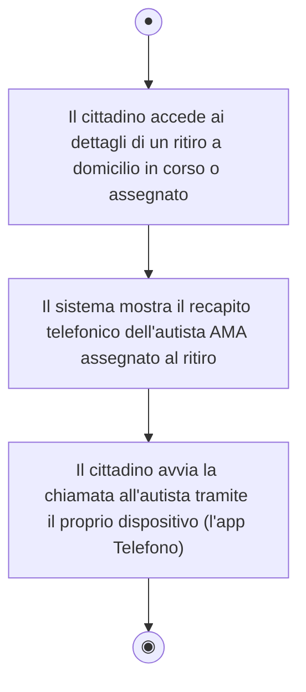

#### Descrizione del Flusso Operativo:
1. **Accesso Dettaglio Ritiro**: Il cittadino visualizza la prenotazione del ritiro in stato `Assegnato` o `In Corso`.
2. **Esposizione Contatto**: Il sistema espone il numero di servizio dell'autista assegnato alla corsa.
3. **Avvio Comunicazione**: L'applicazione mobile/web invoca l'URI `tel:` instradando la chiamata vocale tramite il modulo telefonico del dispositivo.

---

## 5.1.3 Autista AMA

Questa sezione modella i flussi operativi del personale addetto alla raccolta stradale e domiciliare.

---

### AD-13: Visualizzare ritiri assegnati / Consultare dettagli del ritiro

- **Riferimento File Immagine**: [Visualizzare ritiri assegnati _ Consultare dettagli del ritiro  .jpg](file:///c:/Users/Luca/Desktop/ISW/PROGETTOISW/MYAMA/PROGETTOFINALE/ACTIVITY%20DIAGRAM/FOTO%20ACTIVITY%20DIAGRAM%20LUCA/Visualizzare%20ritiri%20assegnati%20_%20Consultare%20dettagli%20del%20ritiro%20%20.jpg)
- **Attore primario**: Autista AMA
- **Contesto e Obiettivo**: Permettere all'autista di visualizzare la lista dei ritiri giornalieri assegnati al proprio veicolo e approfondire le informazioni operative di ciascuna fermata.

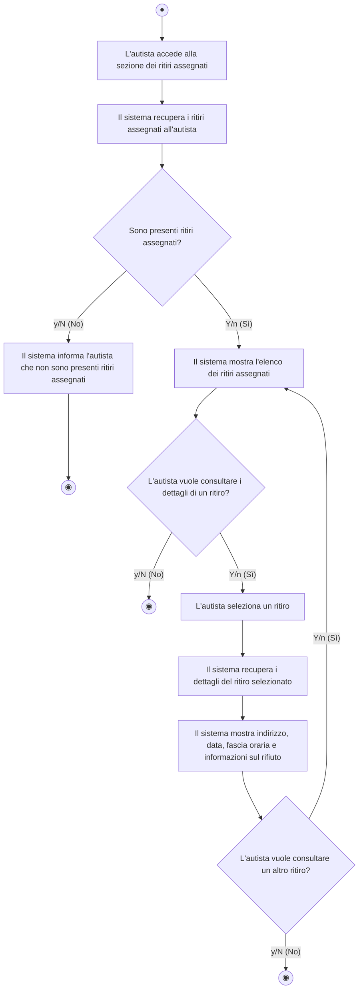

#### Descrizione del Flusso Operativo:
1. **Recupero Turno**: L'autista accede all'applicazione di bordo e interroga il sistema sui ritiri del turno corrente.
   - Se non vi sono ritiri (`[y/N]`), il sistema notifica l'assenza di incarichi e termina.
2. **Elenco e Selezione**: Con incarichi attivi (`[Y/n]`), viene esposto l'itinerario. L'autista può scegliere se consultare il dettaglio di una fermata (`[Y/n]`) o uscire (`[y/N]`).
3. **Consultazione Dettagli**: Il sistema espone indirizzo esatto, piano/note civiche, orario previsto e descrizione/quantità del rifiuto ingombrante.
4. **Ciclo di Consultazione**: L'autista può ripetere la consultazione per ulteriori ritiri o concludere la visualizzazione.

---

### AD-14: Registrare esito del ritiro

- **Riferimento File Immagine**: [Registrare esito del ritiro.jpg](file:///c:/Users/Luca/Desktop/ISW/PROGETTOISW/MYAMA/PROGETTOFINALE/ACTIVITY%20DIAGRAM/FOTO%20ACTIVITY%20DIAGRAM%20LUCA/Registrare%20esito%20del%20ritiro.jpg)
- **Attore primario**: Autista AMA
- **Contesto e Obiettivo**: Aggiornare in tempo reale lo stato del servizio di ritiro (es. completato con successo, rifiuto non conforme, utente assente).

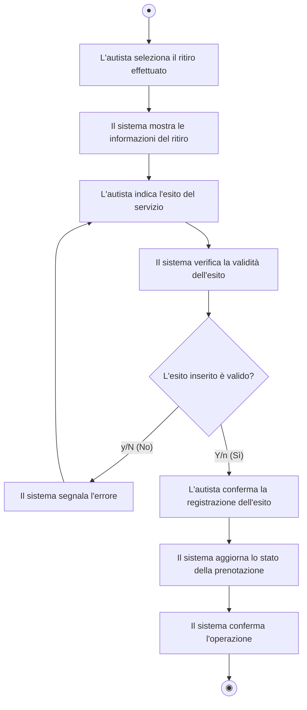

#### Descrizione del Flusso Operativo:
1. **Selezione Corsa**: L'autista seleziona la prenotazione corrispondente alla fermata completata.
2. **Inserimento Esito**: Viene inserito l'esito formale (es. *Eseguito*, *Mancata Consegna*, *Rifiuto Non Conforme* con eventuali note).
3. **Validazione**: Il sistema controlla che le informazioni obbligatorie siano presenti.
   - In caso di dati mancanti (`[y/N]`), segnala l'anomalia e richiede la reinserimento.
4. **Chiusura Record**: Con dati validi (`[Y/n]`) e conferma dell'operatore, il sistema aggiorna lo stato della prenotazione in modo definitivo, rilasciando messaggio di successo.

---

### AD-15: Chiamare cittadino

- **Riferimento File Immagine**: [Chiamare cittadino.jpg](file:///c:/Users/Luca/Desktop/ISW/PROGETTOISW/MYAMA/PROGETTOFINALE/ACTIVITY%20DIAGRAM/FOTO%20ACTIVITY%20DIAGRAM%20LUCA/Chiamare%20cittadino.jpg)
- **Attore primario**: Autista AMA
- **Contesto e Obiettivo**: Consentire all'autista di mettersi in contatto con il cittadino in prossimità del domicilio (es. citofono guasto, difficoltà di reperimento civico).

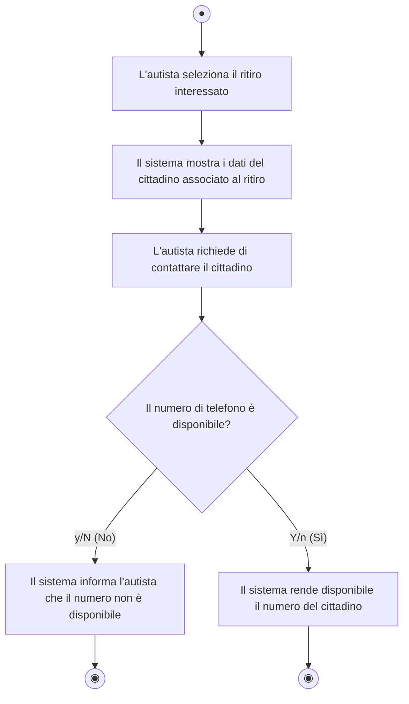

#### Descrizione del Flusso Operativo:
1. **Selezione Fermata**: L'autista apre la scheda del ritiro attivo.
2. **Richiesta Contatto**: Seleziona il comando di chiamata diretta.
3. **Verifica Disponibilità Recapito**: Il sistema controlla la presenza a database di un recapito telefonico valido per l'utente.
   - Se assente (`[y/N]`), notifica l'indisponibilità.
   - Se presente (`[Y/n]`), fornisce il numero o apre il dialer vocale consentendo la comunicazione.

---

## 5.1.4 Operatore di Sede AMA

Questa sezione descrive le procedure eseguite dal personale preposto alla gestione degli accessi e dei conferimenti presso i centri di raccolta fisici.

---

### AD-16: Visualizzare prenotazioni della sede / Consultare dettagli

- **Riferimento File Immagine**: [Visualizzare prenotazioni della sede _ Consultare dettagli  .jpg](file:///c:/Users/Luca/Desktop/ISW/PROGETTOISW/MYAMA/PROGETTOFINALE/ACTIVITY%20DIAGRAM/FOTO%20ACTIVITY%20DIAGRAM%20LUCA/Visualizzare%20prenotazioni%20della%20sede%20_%20Consultare%20dettagli%20%20.jpg)
- **Attore primario**: Operatore di Sede AMA
- **Contesto e Obiettivo**: Monitorare gli arrivi previsti dei cittadini presso l'isola ecologica durante il turno di lavoro.

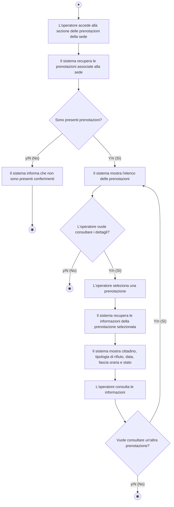

#### Descrizione del Flusso Operativo:
1. **Accesso e Recupero**: L'operatore accede al gestionale della propria sede. Il sistema estrae i conferimenti pianificati per la giornata.
   - Se non vi sono prenotazioni (`[y/N]`), ne dà comunicazione a schermo.
2. **Elenco e Selezione**: Con prenotazioni attive (`[Y/n]`), viene mostrata la lista. L'operatore può selezionare una voce specifica.
3. **Esame Scheda**: Vengono esposti nominativo cittadino, tipologia/foto del rifiuto, slot orario e stato.
4. **Ciclo di Consultazione**: È possibile esaminare iterativamente più prenotazioni tornando all'elenco.

---

### AD-17: Verificare prenotazione del cittadino

- **Riferimento File Immagine**: [Verificare prenotazione del cittadino.jpg](file:///c:/Users/Luca/Desktop/ISW/PROGETTOISW/MYAMA/PROGETTOFINALE/ACTIVITY%20DIAGRAM/FOTO%20ACTIVITY%20DIAGRAM%20LUCA/Verificare%20prenotazione%20del%20cittadino.jpg)
- **Attore primario**: Operatore di Sede AMA
- **Contesto e Obiettivo**: Accogliere il cittadino al gate di ingresso dell'isola ecologica, verificando la corrispondenza tra la prenotazione e il materiale conferito.

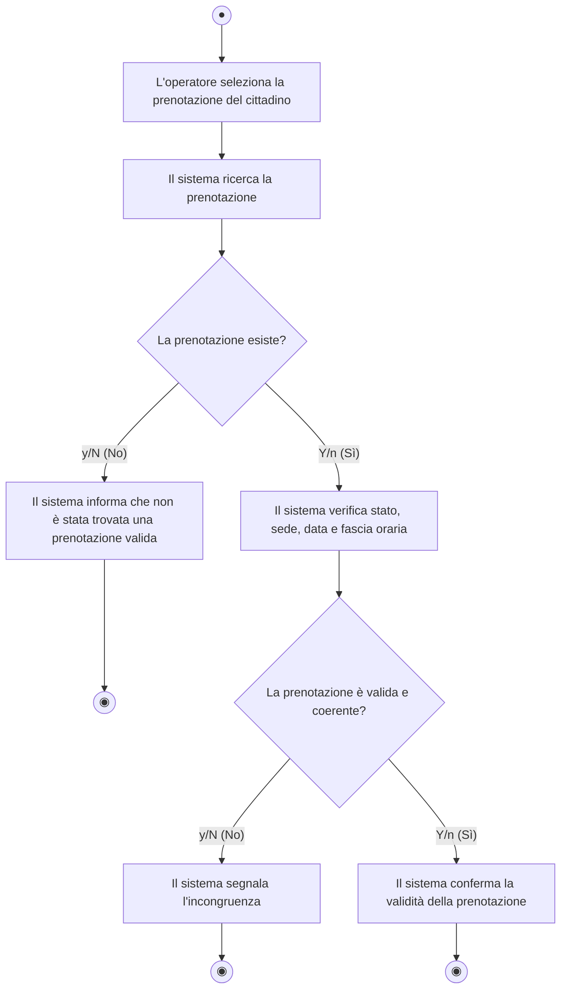

#### Descrizione del Flusso Operativo:
1. **Identificazione**: Il cittadino si presenta allo sportello e l'operatore inserisce il codice prenotazione o il codice fiscale.
2. **Ricerca Record**: Il sistema interroga il database.
   - Se non trovata (`[y/N]`), il sistema blocca l'accesso notificando l'assenza di prenotazione valida.
3. **Verifica Coerenza Operativa**: Se la prenotazione esiste (`[Y/n]`), il sistema controlla che la sede coincida e che l'orario rientri nella fascia prenotata.
   - Se vi sono discrepanze di sede o data (`[y/N]`), segnala l'incongruenza.
   - Se tutto è regolare (`[Y/n]`), convalida la prenotazione autorizzando il cittadino a scaricare il rifiuto.

---

### AD-18: Registrare esito del conferimento

- **Riferimento File Immagine**: [Registrare esito del conferimento.jpg](file:///c:/Users/Luca/Desktop/ISW/PROGETTOISW/MYAMA/PROGETTOFINALE/ACTIVITY%20DIAGRAM/FOTO%20ACTIVITY%20DIAGRAM%20LUCA/Registrare%20esito%20del%20conferimento.jpg)
- **Attore primario**: Operatore di Sede AMA
- **Contesto e Obiettivo**: Registrare formalmente la conclusione dello scarico del rifiuto, validando il conferimento o registrando eventuali irregolarità.

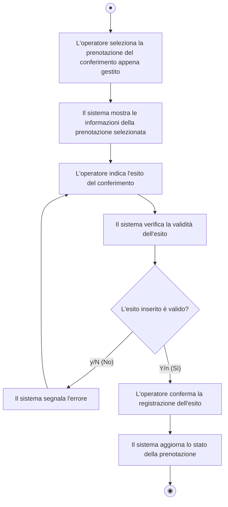

#### Descrizione del Flusso Operativo:
1. **Selezione Pratica**: A scarico avvenuto, l'operatore richiama la scheda della prenotazione verificata.
2. **Inserimento Risultato**: Imposta l'esito finale (*Conferito con successo*, *Rifiuto respinto per non conformità*, ecc.).
3. **Controllo e Conferma**: Il sistema convalida la sintassi dei dati; a conferma dell'operatore, la prenotazione assume lo stato `Completata` (o `Rifiutata`) e l'operazione viene archiviata.

---

## 5.1.5 Amministratore di Sede AMA

Questa sezione modella i processi di gestione delle risorse (personale, mezzi), delle fasce orarie e della copertura territoriale di competenza della singola sede zonale.

---

### AD-19: Generare codice di invito per il personale

- **Riferimento File Immagine**: [Genera codice di invito2.png](file:///c:/Users/Luca/Desktop/ISW/PROGETTOISW/MYAMA/PROGETTOFINALE/ACTIVITY%20DIAGRAM/FOTO%20ACTIVITY%20DIAGRAM%20ALFREDO/Genera%20codice%20di%20invito2.png)
- **Attore primario**: Amministratore di Sede AMA
- **Contesto e Obiettivo**: Emettere un token di invito sicuro per l'onboarding di nuovi operatori o autisti assegnati alla specifica sede.

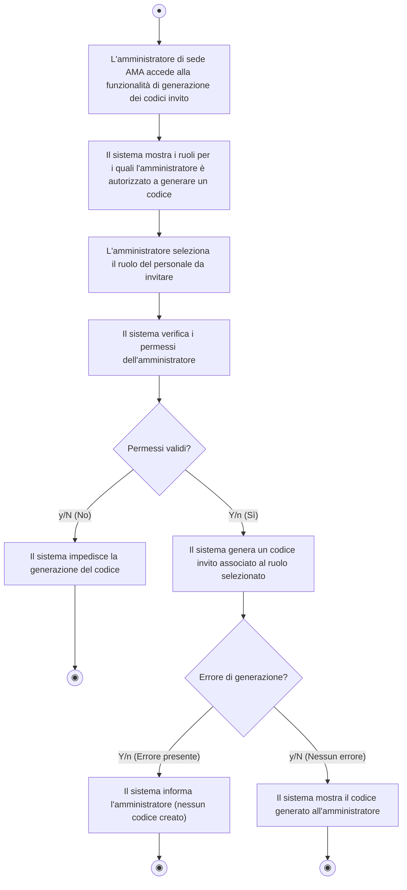

#### Descrizione del Flusso Operativo:
1. **Accesso Gestione Inviti**: L'amministratore accede alla schermata di generazione credenziali.
2. **Selezione Ruolo**: Sceglie il profilo da invitare (Autista o Operatore di Sede).
3. **Verifica Autorizzazioni**: Il sistema controlla che l'amministratore abbia i privilegi di sede per quel ruolo.
   - Se privo di permessi (`[y/N]`), l'azione viene bloccata.
4. **Generazione e Visualizzazione**: Se autorizzato (`[Y/n]`), viene creato un token univoco con scadenza. Se la transazione va a buon fine, il codice viene esposto per la consegna all'operatore.

---

### AD-20: Gestire disponibilità dei lavoratori

- **Riferimento File Immagine**: [Gestire disponibilità dei lavoratori.png](file:///c:/Users/Luca/Desktop/ISW/PROGETTOISW/MYAMA/PROGETTOFINALE/ACTIVITY%20DIAGRAM/FOTO%20ACTIVITY%20DIAGRAM%20ALFREDO/Gestire%20disponibilit%C3%A0%20dei%20lavoratori.png)
- **Attore primario**: Amministratore di Sede AMA
- **Contesto e Obiettivo**: Pianificare i turni di lavoro, ferie o assenze del personale operativo afferente alla sede.

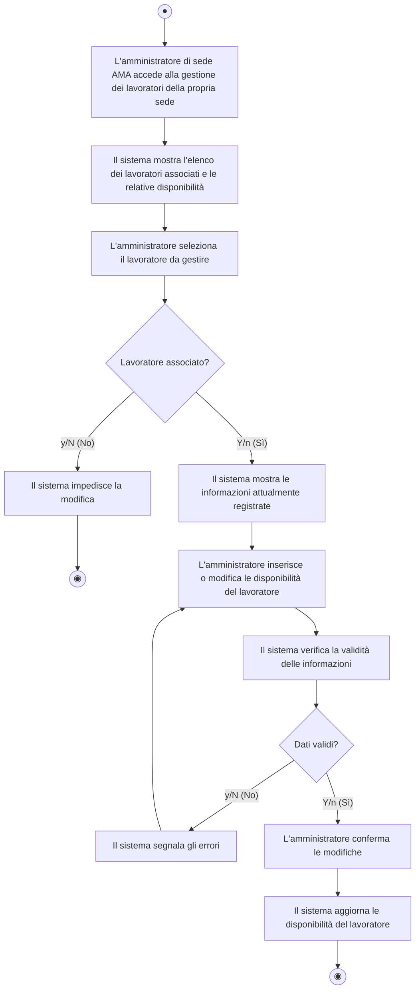

#### Descrizione del Flusso Operativo:
1. **Consultazione Personale**: L'amministratore apre l'organico di sede con i turni attuali.
2. **Selezione e Controllo**: Seleziona un dipendente; il sistema verifica che sia effettivamente incardinato nella sede.
3. **Modifica Calendario**: Imposta fasce orarie lavorative, cambi turno o indisponibilità.
4. **Validazione Regole**: Il sistema controlla la conformità con l'orario di servizio e, a conferma dell'admin, aggiorna i turni a database.

---

### AD-21: Gestire disponibilità dei veicoli

- **Riferimento File Immagine**: [Gestire disponibilità dei veicoli.png](file:///c:/Users/Luca/Desktop/ISW/PROGETTOISW/MYAMA/PROGETTOFINALE/ACTIVITY%20DIAGRAM/FOTO%20ACTIVITY%20DIAGRAM%20ALFREDO/Gestire%20disponibilit%C3%A0%20dei%20veicoli.png)
- **Attore primario**: Amministratore di Sede AMA
- **Contesto e Obiettivo**: Monitorare la flotta di automezzi della sede, impostare stati di manutenzione/guasto o modificare le capacità di carico assegnate alle corse.

```mermaid
flowchart TD
    Start((●)) --> A1["L'amministratore di sede AMA accede alla sezione dedicata ai veicoli"]
    A1 --> A2["Il sistema mostra i veicoli associati e le relative disponibilità"]
    A2 --> A3["L'amministratore seleziona un veicolo"]
    A3 --> D1{"Veicolo associato?"}
    D1 -- "y/N (No)" --> E1["Il sistema impedisce l'aggiornamento delle relative informazioni"]
    E1 --> End1((◉))
    D1 -- "Y/n (Sì)" --> A4["Il sistema mostra la disponibilità attualmente registrata"]
    A4 --> A5["L'amministratore modifica le informazioni di disponibilità"]
    A5 --> A6["Il sistema verifica la validità dei dati inseriti"]
    A6 --> D2{"Dati validi?"}
    D2 -- "y/N (No)" --> E2["Il sistema segnala gli errori"]
    E2 --> A5
    D2 -- "Y/n (Sì)" --> A7["L'amministratore conferma le modifiche"]
    A7 --> A8["Il sistema aggiorna la disponibilità del veicolo"]
    A8 --> End2((◉))
```

#### Descrizione del Flusso Operativo:
1. **Apertura Flotta**: Visualizzazione di tutti i mezzi in dotazione con stato di efficienza e portata utile.
2. **Selezione Mezzo**: Scelta del veicolo da revisionare (es. camioncino cassonato, compattatore).
3. **Aggiornamento Disponibilità**: Modifica dello stato operativo (es. *Disponibile*, *In Manutenzione*, *Fuori Servizio*).
4. **Salvataggio**: Il sistema verifica l'assenza di sovrapposizioni con ritiri già schedulati e rende persistente l'aggiornamento.

---

### AD-22: Gestire disponibilità della sede e fasce orarie

- **Riferimento File Immagine**: [Gestire disponibiltà della sede e fasce orarie.png](file:///c:/Users/Luca/Desktop/ISW/PROGETTOISW/MYAMA/PROGETTOFINALE/ACTIVITY%20DIAGRAM/FOTO%20ACTIVITY%20DIAGRAM%20ALFREDO/Gestire%20disponibilt%C3%A0%20della%20sede%20e%20fasce%20orarie.png)
- **Attore primario**: Amministratore di Sede AMA
- **Contesto e Obiettivo**: Configurare gli orari di apertura al pubblico e il contingentamento degli accessi per i conferimenti in sede.

```mermaid
flowchart TD
    Start((●)) --> A1["L'amministratore di sede AMA accede alla configurazione della sede"]
    A1 --> A2["Il sistema mostra giorni e fasce orarie attualmente disponibili"]
    A2 --> A3["L'amministratore seleziona le disponibilità da modificare"]
    A3 --> A4["L'amministratore inserisce, modifica o rimuove giorni e fasce orarie"]
    A4 --> A5["Il sistema verifica la validità delle informazioni inserite"]
    A5 --> D1{"Fasce orarie valide?"}
    D1 -- "y/N (No)" --> E1["Il sistema segnala l'errore e richiede correzione"]
    E1 --> A4
    D1 -- "Y/n (Sì)" --> A6["L'amministratore conferma le modifiche"]
    A6 --> A7["Il sistema aggiorna le disponibilità della sede"]
    A7 --> End((◉))
```

#### Descrizione del Flusso Operativo:
1. **Configurazione Orari**: L'amministratore visualizza il piano settimanale della sede.
2. **Editing Slot**: Aggiunge nuovi blocchi orari, modifica i limiti di capienza contemporanea o disattiva giorni festivi.
3. **Validazione e Commit**: Il sistema verifica che non vi siano sovrapposizioni orarie anomale e aggiorna la disponibilità mostrata ai cittadini.

---

### AD-23: Gestire associazioni tra sede e zone/CAP

- **Riferimento File Immagine**: [Gestire associazioni tra sede e zone cap.png](file:///c:/Users/Luca/Desktop/ISW/PROGETTOISW/MYAMA/PROGETTOFINALE/ACTIVITY%20DIAGRAM/FOTO%20ACTIVITY%20DIAGRAM%20ALFREDO/Gestire%20associazioni%20tra%20sede%20e%20zone%20cap.png)
- **Attore primario**: Amministratore di Sede AMA
- **Contesto e Obiettivo**: Definire o aggiornare i CAP e i quartieri coperti dalla propria sede zonale per l'erogazione dei servizi di ritiro e conferimento.

```mermaid
flowchart TD
    Start((●)) --> A1["L'amministratore di sede AMA accede alla sezione copertura territoriale"]
    A1 --> A2["Il sistema mostra le zone e i CAP attualmente associati alla sede"]
    A2 --> A3["L'amministratore aggiunge, modifica o rimuove un'associazione zona/CAP"]
    A3 --> A4["Il sistema verifica la validità dell'associazione"]
    A4 --> D1{"Associazione valida?"}
    D1 -- "y/N (No)" --> E1["Il sistema segnala l'errore (non valido o duplicato)"]
    E1 --> A3
    D1 -- "Y/n (Sì)" --> A5["L'amministratore conferma le modifiche"]
    A5 --> A6["Il sistema aggiorna le associazioni territoriali della sede"]
    A6 --> End((◉))
```

#### Descrizione del Flusso Operativo:
1. **Visualizzazione Copertura**: Elenco dei codici postali (CAP) e zone attualmente presidiate.
2. **Modifica Mappatura**: Aggiunta di un nuovo CAP servito o rimozione di un'area non più coperta.
3. **Controllo Duplicati**: Il sistema garantisce che il CAP sia formalmente valido. A conferma dell'amministratore, la nuova copertura entra in vigore per le future prenotazioni.

---

### AD-24: Rimuovere lavoratori dalla sede

- **Riferimento File Immagine**: [Rimuovere lavoratori.png](file:///c:/Users/Luca/Desktop/ISW/PROGETTOISW/MYAMA/PROGETTOFINALE/ACTIVITY%20DIAGRAM/FOTO%20ACTIVITY%20DIAGRAM%20ALFREDO/Rimuovere%20lavoratori.png)
- **Attore primario**: Amministratore di Sede AMA
- **Contesto e Obiettivo**: Disassociare un dipendente (autista o operatore) dalla sede a seguito di trasferimento, dimissioni o cambio mansione.

```mermaid
flowchart TD
    Start((●)) --> A1["L'amministratore di sede AMA accede alla sezione dedicata al personale"]
    A1 --> A2["Il sistema mostra i membri associati alla sede"]
    A2 --> A3["L'amministratore seleziona il membro del personale da rimuovere"]
    A3 --> D1{"Membro associato?"}
    D1 -- "y/N (No)" --> E1["Il sistema informa l'amministratore che il membro non è associato"]
    E1 --> End1((◉))
    D1 -- "Y/n (Sì)" --> A4["Il sistema mostra le informazioni del profilo selezionato"]
    A4 --> A5["L'amministratore richiede la rimozione del membro dalla sede"]
    A5 --> A6["Il sistema richiede conferma dell'operazione"]
    A6 --> D2{"Conferma operazione?"}
    D2 -- "y/N (No)" --> E2["Nessuna modifica effettuata"]
    E2 --> End2((◉))
    D2 -- "Y/n (Sì)" --> A7["Il sistema rimuove l'associazione e conferma l'operazione"]
    A7 --> End3((◉))
```

#### Descrizione del Flusso Operativo:
1. **Ricerca Dipendente**: Individuazione del lavoratore nell'elenco del personale di sede.
2. **Verifica Appartenenza**: Controllo dell'effettivo legame contrattuale/organizzativo con la sede.
3. **Richiesta e Conferma**: L'amministratore avvia la procedura di disattivazione; il sistema richiede una conferma esplicita anti-errore.
4. **Revoca Associazione**: Confermata l'operazione, il profilo viene sganciato dalla sede impedendo l'assegnazione di futuri turni.

---

## 5.1.6 Amministratore Generale AMA

Questa sezione modella i casi d'uso ad alto livello riservati alla dirigenza centrale di AMA per la gestione complessiva della rete di sedi e dei rispettivi responsabili.

---

### AD-25: Generare codice amministratore di sede

- **Riferimento File Immagine**: [Generare codice amministratore di sede.jpg](file:///c:/Users/Luca/Desktop/ISW/PROGETTOISW/MYAMA/PROGETTOFINALE/ACTIVITY%20DIAGRAM/FOTO%20ACTIVITY%20DIAGRAM%20SAMUELE/Amministratore%20generale%20AMA/Generare%20codice%20amministratore%20di%20sede.jpg)
- **Attore primario**: Amministratore Generale AMA
- **Contesto e Obiettivo**: Creare un token di accreditamento speciale per abilitare la registrazione di un nuovo Amministratore di Sede.

```mermaid
flowchart TD
    Start((●)) --> A1["L'amministratore generale accede alla gestione codici"]
    A1 --> A2["Il sistema verifica i permessi"]
    A2 --> D1{"Permessi necessari presenti?"}
    D1 -- "y/N (No)" --> E1["Il sistema impedisce la generazione del codice"]
    E1 --> E2["Il sistema mostra un messaggio di errore"]
    E2 --> End1((◉))
    D1 -- "Y/n (Sì)" --> A3["L'amministratore generale richiede un codice per un amministratore di sede"]
    A3 --> A4["Il sistema genera il codice invito"]
    A4 --> D2{"Generazione riuscita?"}
    D2 -- "y/N (No)" --> E3["Il sistema segnala gli errori"]
    E3 --> E4["Il sistema non genera alcun codice valido"]
    E4 --> End2((◉))
    D2 -- "Y/n (Sì)" --> A5["Il sistema mostra il codice generato"]
    A5 --> A6["L'amministratore generale comunica il codice al nuovo admin di sede"]
    A6 --> End3((◉))
```

#### Descrizione del Flusso Operativo:
1. **Controllo Super-User**: L'utente accede alla console centrale; il sistema convalida i massimi privilegi di sicurezza.
   - Se non conforme (`[y/N]`), l'accesso alla funzionalità viene rigettato.
2. **Richiesta Token Admin**: L'Amministratore Generale richiede la creazione di un codice univoco associato al ruolo di `Amministratore di Sede` per una specifica struttura territoriale.
3. **Creazione e Rilascio**: Il sistema genera la chiave crittografica e la presenta all'amministratore per la successiva trasmissione al responsabile designato.

---

### AD-26: Rimuovere amministratore di sede AMA

- **Riferimento File Immagine**: [Rimuovere amministratore di sede AMA.jpg](file:///c:/Users/Luca/Desktop/ISW/PROGETTOISW/MYAMA/PROGETTOFINALE/ACTIVITY%20DIAGRAM/FOTO%20ACTIVITY%20DIAGRAM%20SAMUELE/Amministratore%20generale%20AMA/Rimuovere%20amministratore%20di%20sede%20AMA.jpg)
- **Attore primario**: Amministratore Generale AMA
- **Contesto e Obiettivo**: Revocare la qualifica e i permessi di amministrazione a un responsabile di sede dismesso o avvicendato.

```mermaid
flowchart TD
    Start((●)) --> A1["L'amministratore generale AMA accede alla sezione di gestione degli amministratori di sede"]
    A1 --> A2["Il sistema mostra l'elenco degli amministratori di sede registrati"]
    A2 --> A3["L'amministratore generale seleziona l'amministratore di sede da rimuovere"]
    A3 --> A4["Il sistema mostra le informazioni dell'amministratore selezionato"]
    A4 --> D1{"Amministratore presente e attivo?"}
    D1 -- "y/N (No)" --> E1["Il sistema informa che l'amministratore non è più presente o attivo"]
    E1 --> End1((◉))
    D1 -- "Y/n (Sì)" --> A5["L'amministratore generale richiede la rimozione dell'amministratore di sede"]
    A5 --> A6["Il sistema richiede la conferma dell'operazione"]
    A6 --> D2{"L'amministratore conferma la rimozione?"}
    D2 -- "y/N (No)" --> E2["Il sistema annulla l'operazione senza effettuare modifiche"]
    E2 --> End2((◉))
    D2 -- "Y/n (Sì)" --> A7["Il sistema rimuove il ruolo di amministratore di sede"]
    A7 --> D3{"Rimozione completata correttamente?"}
    D3 -- "y/N (No)" --> E3["Il sistema mostra un messaggio di errore"]
    E3 --> End3((◉))
    D3 -- "Y/n (Sì)" --> A8["Il sistema conferma l'avvenuta rimozione"]
    A8 --> End4((◉))
```

#### Descrizione del Flusso Operativo:
1. **Consultazione Amministratori Sede**: Apertura dell'anagrafica centralizzata di tutti i responsabili territoriali.
2. **Selezione Utenza**: Selezione del profilo target con verifica dello stato di attività (`[Y/n]`).
3. **Conferma di Sicurezza**: Richiesta di conferma esplicita prima di eseguire la revoca dei privilegi.
4. **Revoca Ruolo**: Il sistema revoca il ruolo `Amministratore di Sede`, disabilitando l'accesso al pannello di controllo della sede corrispondente e registrando l'evento nei log di audit.

---

## 📊 Tabella Sinottica di Riepilogo e Tracciabilità

| ID AD | Nome Diagramma | Attore Coinvolto | File Immagine Originale |
|---|---|---|---|
| **AD-01** | Registrarsi come cittadino | Utente non registrato | `FOTO ACTIVITY DIAGRAM SAMUELE/Utente non registrato - Utente di sistema/Registrarsi come cittadino.jpg` |
| **AD-02** | Registrarsi tramite codice invito | Utente non registrato (Staff) | `FOTO ACTIVITY DIAGRAM SAMUELE/Utente non registrato - Utente di sistema/Registrarsi tramite codice di invito.jpg` |
| **AD-03** | Effettuare accesso | Utente di sistema | `FOTO ACTIVITY DIAGRAM SAMUELE/Utente non registrato - Utente di sistema/Effettuare accesso.jpg` |
| **AD-04** | Richiedere ritiro a domicilio | Cittadino | `FOTO ACTIVITY DIAGRAM DAVIDE/ActivityDiagramRichiestaRitiroDomicilio.jpg` |
| **AD-05** | Prenotare conferimento in sede AMA | Cittadino | `FOTO ACTIVITY DIAGRAM DAVIDE/ActivityDiagramRichiestaPrenotaConferimento.jpg` |
| **AD-06** | Visualizzare sedi compatibili | Cittadino | `FOTO ACTIVITY DIAGRAM DAVIDE/ActivityDiagramVisualizzareSediCompatibili.jpg` |
| **AD-07** | Visualizzare date e fasce disponibili | Cittadino | `FOTO ACTIVITY DIAGRAM DAVIDE/ActivityDiagramVIsualizzareDataOraDisponibili.jpg` |
| **AD-08** | Visualizzare prenotazioni attive | Cittadino | `FOTO ACTIVITY DIAGRAM DAVIDE/ActivityDiagramVisualizzarePrenotazioniAttive.jpg` |
| **AD-09** | Annullare prenotazione | Cittadino | `FOTO ACTIVITY DIAGRAM DAVIDE/ActivityDiagramAnnullarePrenotazione.jpg` |
| **AD-10** | Visualizzare storico prenotazioni | Cittadino | `FOTO ACTIVITY DIAGRAM DAVIDE/ActivityDiagramVisualizzareStoricoPrenotazioni.jpg` |
| **AD-11** | Valutare il servizio | Cittadino | `FOTO ACTIVITY DIAGRAM DAVIDE/ActivityDiagramChiamareAutista.jpg` *(swap nome file)* |
| **AD-12** | Chiamare autista AMA | Cittadino | `FOTO ACTIVITY DIAGRAM DAVIDE/ActivityDiagramValutareIlServizio.jpg` *(swap nome file)* |
| **AD-13** | Visualizzare ritiri assegnati | Autista AMA | `FOTO ACTIVITY DIAGRAM LUCA/Visualizzare ritiri assegnati _ Consultare dettagli del ritiro  .jpg` |
| **AD-14** | Registrare esito del ritiro | Autista AMA | `FOTO ACTIVITY DIAGRAM LUCA/Registrare esito del ritiro.jpg` |
| **AD-15** | Chiamare cittadino | Autista AMA | `FOTO ACTIVITY DIAGRAM LUCA/Chiamare cittadino.jpg` |
| **AD-16** | Visualizzare prenotazioni sede | Operatore di Sede AMA | `FOTO ACTIVITY DIAGRAM LUCA/Visualizzare prenotazioni della sede _ Consultare dettagli  .jpg` |
| **AD-17** | Verificare prenotazione cittadino | Operatore di Sede AMA | `FOTO ACTIVITY DIAGRAM LUCA/Verificare prenotazione del cittadino.jpg` |
| **AD-18** | Registrare esito conferimento | Operatore di Sede AMA | `FOTO ACTIVITY DIAGRAM LUCA/Registrare esito del conferimento.jpg` |
| **AD-19** | Generare codice invito personale | Amministratore di Sede | `FOTO ACTIVITY DIAGRAM ALFREDO/Genera codice di invito2.png` |
| **AD-20** | Gestire disponibilità lavoratori | Amministratore di Sede | `FOTO ACTIVITY DIAGRAM ALFREDO/Gestire disponibilità dei lavoratori.png` |
| **AD-21** | Gestire disponibilità veicoli | Amministratore di Sede | `FOTO ACTIVITY DIAGRAM ALFREDO/Gestire disponibilità dei veicoli.png` |
| **AD-22** | Gestire disponibilità sede e fasce | Amministratore di Sede | `FOTO ACTIVITY DIAGRAM ALFREDO/Gestire disponibiltà della sede e fasce orarie.png` |
| **AD-23** | Gestire associazioni sede e zone/CAP | Amministratore di Sede | `FOTO ACTIVITY DIAGRAM ALFREDO/Gestire associazioni tra sede e zone cap.png` |
| **AD-24** | Rimuovere lavoratori dalla sede | Amministratore di Sede | `FOTO ACTIVITY DIAGRAM ALFREDO/Rimuovere lavoratori.png` |
| **AD-25** | Generare codice admin sede | Amministratore Generale | `FOTO ACTIVITY DIAGRAM SAMUELE/Amministratore generale AMA/Generare codice amministratore di sede.jpg` |
| **AD-26** | Rimuovere amministratore di sede | Amministratore Generale | `FOTO ACTIVITY DIAGRAM SAMUELE/Amministratore generale AMA/Rimuovere amministratore di sede AMA.jpg` |
