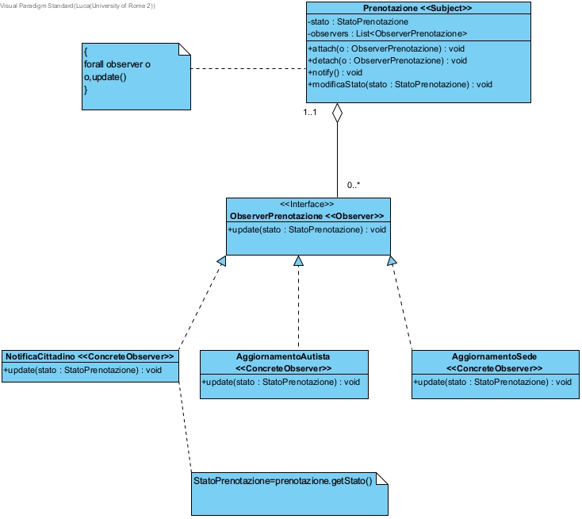
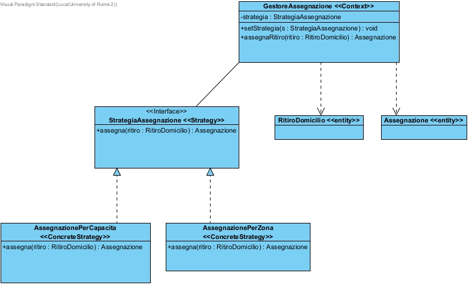

# 6. Design Patterns (Pattern di Progettazione)

% =========================================================================
% 6.1 INTRODUZIONE E METODOLOGIA
% =========================================================================
## Introduzione e Metodologia di Selezione

Come successiva fase per fare una progettazione Object Oriented si vogliono identificare dei problemi strutturali per essere risolti da Design Patterns prestabiliti

### Analisi Critica del Class Diagram Refined

La selezione dei Design Pattern nasce da un' analisi del *Class Diagram Refined*.

Sono stati selezionati due pattern comportamentali complementari:

    * **Observer Pattern:** per risolvere la dipendenza uno-a-molti generata dagli eventi di transizione di stato delle prenotazioni.
    * **Strategy Pattern:** per incapsulare e rendere dinamicamente intercambiabili gli algoritmi di ottimizzazione e assegnazione dei carichi di lavoro.

% =========================================================================
% 6.2 OBSERVER PATTERN
% =========================================================================
## Observer Pattern (Pattern Comportamentale)

### Descrizione del Problema e Soluzione Progettuale

Il problema principale della classe `Prenotazione` è che subisce continui cambiamenti di stato nel corso del suo ciclo di vita (es. passaggio da _In attesa_ a _Confermata_, _In corso_, _Completata_ o _Annullata_) e i vari sottosistemi devono essere aggiornati di conseguenza. Se fosse proprio la classe `Prenotazione` a dover invocare direttamente i metodi delle altre classi dei sottosistemi (come `NotificaCittadino`, `AggiornamentoAutista` o `AggiornamentoSede`), essa accumulerebbe troppe responsabilità.
Inoltre, questo approccio non garantirebbe la flessibilità del codice: se in futuro si volesse aggiungere un nuovo modulo interessato a questi cambiamenti (come un nuovo sistema di tracking), bisognerebbe per forza lavorare all'interno del codice della classe `Prenotazione`, compromettendo la manutenibilità del sistema.

A tal proposito viene identificato il Design Pattern **Observer** (di tipo Comportamentale): in questo modo la classe viene deresponsabilizzata e, quando l'oggetto cambia stato, tutti gli oggetti interessati (_Observers_) vengono notificati e si aggiornano in automatico.

### Partecipanti

    * **Subject (Observable):** la classe `Prenotazione`. Contiene i metodi per registrare (`registraObserver(obs)`), rimuovere (`rimuoviObserver(obs)`) e notificare (`notificaObserver()`) gli ascoltatori, oltre alla gestione del proprio stato interno (`StatoPrenotazione`).
    * **Observer:** l'interfaccia `ObserverPrenotazione` che espone il metodo polimorfico `update(stato: StatoPrenotazione)`.
    * **ConcreteObserver:** le classi concrete che implementano l'interfaccia, ovvero `NotificaCittadino`, `AggiornamentoAutista` e `AggiornamentoSede`. Ciascuna di esse implementa la propria logica specifica all'interno del metodo `update`.

% =========================================================================
% 6.3 STRATEGY PATTERN
% =========================================================================
## Strategy Pattern (Pattern Comportamentale)

### Descrizione del Problema e Soluzione Progettuale

Il problema principale nella gestione operativa dei ritiri a domicilio è che la composizione dell'itinerario dei veicoli varia spesso a seconda delle politiche aziendali del momento. In particolare, il sistema deve poter supportare differenti algoritmi di assegnazione:

- **Politica di Massimizzazione del Carico (`AssegnazionePerCapacita`)**: per ottimizzare il riempimento (in volume e peso) dei mezzi minimizzando il numero di corse
- **Politica di Prossimità Territoriale (`AssegnazionePerZona`)**: per minimizzare i tempi e i chilometri percorsi raggruppando i ritiri per CAP limitrofi

Se la logica di calcolo di tutti questi algoritmi venisse inserita direttamente all'interno della singola classe del controllore di assegnazione (impiegando complesse e lunghe catene di `if-else` o `switch-case`), la classe accumulerebbe troppe responsabilità, diventando inutilmente grande e difficilmente manutenibile.

Inoltre, questo approccio non garantirebbe la flessibilità del codice: se in futuro l'azienda volesse aggiungere una nuova politica di smistamento (ad esempio un'assegnazione per "Urgenza"), bisognerebbe per forza rimettere mano al codice sorgente del controllore, rischiando di compromettere una classe già testata e funzionante.

A tal proposito viene identificato il Design Pattern **Strategy** (di tipo Comportamentale): in questo modo ogni algoritmo viene separato in una classe a sé stante. Il controllore viene così deresponsabilizzato dalla logica matematica e si limita a interagire con un'interfaccia comune, permettendo al sistema di cambiare strategia di calcolo in modo dinamico e garantendo un'alta manutenibilità per le aggiunte future.

### Partecipanti

    * **Context:** la classe di controllo (`GestoreAssegnazione` / `PrenotazioneControl`). Essa mantiene un riferimento all'interfaccia `StrategiaAssegnazione` ed espone le operazioni per coordinare l'allocazione delle risorse delegando alla strategia attiva.
    * **Strategy:** l'interfaccia `StrategiaAssegnazione` che dichiara il metodo astratto polimorfico `assegna(ritiro: RitiroDomicilio): Assegnazione`.
    * **ConcreteStrategy:** le classi concrete che incapsulano le singole logiche aziendali, ovvero `AssegnazionePerCapacita` e `AssegnazionePerZona`. Ciascuna di esse implementa in modo differente il metodo dell'interfaccia.

