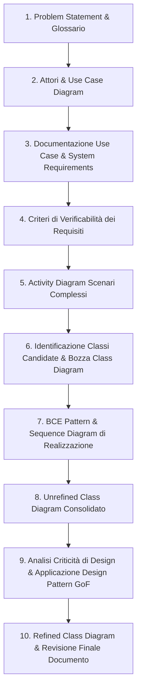
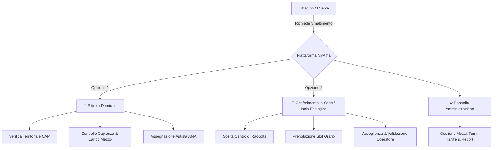

# 🚀 Progetto di Ingegneria del Software — *MyAma*

<div align="center">


</div>

---

## 📖 Panoramica del Progetto

Questa repository contiene tutto il materiale, la documentazione metodologica, i compendi teorici e gli esempi pratici per lo sviluppo del **Progetto d'Esame di Ingegneria del Software** (CdS in Informatica, Università degli Studi di Roma "Tor Vergata").

Il progetto è incentrato sull'ingegnerizzazione e specifica formale del sistema **`MyAma`**, una piattaforma digitale integrata per la **gestione, pianificazione e ottimizzazione delle prenotazioni per il ritiro e conferimento dei rifiuti urbani ingombranti e speciali** per la città di Roma.

---

## 🧭 Navigazione Rapida nei Documenti di Progetto

| Documento | Natura | Descrizione |
|---|---|---|
| 📂 **[`MYAMA/`](./MYAMA)** | **Cartella Progetto** | **Spazio di lavoro del progetto**: contiene la specifica formale IEEE 830, i file di lavoro (`decisioni.md`, `tracciabilita.md`) e i modelli Visual Paradigm. |
| 💡 **[`idea.md`](./idea.md)** | **Visione Generale** | Riepilogo sintetico e intuitivo di MyAma (cittadini, sedi, ritiro a domicilio, conferimento) pensato per allineare rapidamente l'intero gruppo. |
| 📋 **[`ideaprogetto.md`](./ideaprogetto.md)** | **Analisi di Dominio** | Analisi formale del problema (*problem statement*), attori, regole di business, servizi erogati e scenari di modellazione OOA. |
| 📘 **[`guida-progetto.md`](./guida-progetto.md)** | **Teoria & Modello Mentale** | Filo logico metodologico che spiega *perché* ogni passaggio serve (da Problem Statement a Use Case, Requisiti, Diagrammi dinamici/statici e Design Pattern). |
| 🚀 **[`guida-operativa.md`](./guida-operativa.md)** | **Guida Operativa** | Manuale pratico sequenziale di redazione della specifica (input/output di fase, decisioni da prendere e analisi delle parti parallelizzabili). |
| 👥 **[`divisione-compiti.md`](./divisione-compiti.md)** | **Organizzazione Team** | Piano organizzativo per i 5 componenti del gruppo (coppie, task condivisi, review incrociate e merge). |
| 🛠️ **[`guida-git.md`](./guida-git.md)** | **Guida Collaboratori Git** | Manuale pratico Git & GitHub (inviti, setup, ciclo `pull`/`add`/`commit`/`push`, branch e gestione conflitti). |
| 📌 **[`infoprof.md`](./infoprof.md)** | **Linee Guida Docente** | Istruzioni ufficiali del Prof. Andrea D'Ambrogio: standard IEEE 830-1998, OOA, tool Visual Paradigm e scadenze d'esame. |
| 🌳 **[`tree.md`](./tree.md)** | **Mappa della Repository** | Indice dettagliato con descrizione sintetica *one-line* di ogni singola cartella, file e trascrizione. |

---

## 🔄 Il Flusso di Lavoro Metodologico (dall'Idea alla Specifica)

Come illustrato in [`guida-progetto.md`](./guida-progetto.md) e dettagliato in [`guida-operativa.md`](./guida-operativa.md), la redazione della specifica segue una sequenza rigorosa e incrementale:



---

## 💡 Il Dominio Applicativo: *MyAma*

Il sistema modella un servizio logistico distribuito e multi-attore:



### Ruoli & Attori Principali:
- **Cittadino (Cliente)**: Autenticazione (credenziali / SPID), richiesta di ritiro a domicilio o conferimento in sede, geolocalizzazione, upload foto/dati rifiuto, preventivo e tracking stato.
- **Autista AMA (Lavoratore)**: Consultazione itinerario, gestione capienza veicolo ($\sum \text{Pesi} \le \text{CaricoMax}$), registrazione esito ritiro a domicilio.
- **Operatore di Sede (Lavoratore)**: Gestione varchi dei centri di raccolta, verifica conformità rifiuto e convalida scarico.
- **Amministratore / Logistica**: Gestione sedi, associazione zone/CAP, anagrafica mezzi, turnazione lavoratori e tariffari.

---

## 📚 Trascrizioni Integrali dei Progetti di Riferimento

Per facilitare l'analisi testuale e il confronto pagina per pagina senza dipendere da lettori PDF binari, tutte le relazioni benchmark sono organizzate in sottocartelle dedicate:

- 🐟 **[`ALTRI/Progetto_Pesca_Cipolletta/Progetto_Cipolletta_Pesca.md`](./ALTRI/Progetto_Pesca_Cipolletta/Progetto_Cipolletta_Pesca.md)** — Relazione completa (76 pagine) del progetto *Campionato di Pesca Sportiva*.
- 🏨 **[`ALTRI/Progetto_Hotel_Mongelli/Progetto_Mongelli_Hotel.md`](./ALTRI/Progetto_Hotel_Mongelli/Progetto_Mongelli_Hotel.md)** — Relazione completa (59 pagine) del progetto *Hotel TorVergata*.
- 🍽️ **[`ALTRI/Progetto_RistorApp_Bianchini/Progetto_Bianchini_RistorApp.md`](./ALTRI/Progetto_RistorApp_Bianchini/Progetto_Bianchini_RistorApp.md)** — Relazione completa (80 pagine) del progetto *RistorApp*.
- 🏋️ **[`ALTRI/Progetto_Buongiorno_Machowski/Progetto_Buongiorno_Machowski_Muscillo_Politano.pdf`](./ALTRI/Progetto_Buongiorno_Machowski/Progetto_Buongiorno_Machowski_Muscillo_Politano.pdf)** — Relazione PDF del progetto *Buongiorno*.
- ♻️ **[`MYAMABASIDATI/BASI_PROGETTO.md`](./MYAMABASIDATI/BASI_PROGETTO.md)** — Trascrizione della specifica iniziale di *MyAma* per Basi di Dati (30 pagine).

---

## 📁 Struttura della Repository

```text
PROGETTOISW/
├── 📄 README.md                                              # Presentazione generale del repository
├── 💡 idea.md                                                 # Idea sintetica del progetto per allineare il gruppo
├── 📋 ideaprogetto.md                                         # Documento di visione, dominio e regole di business
├── 📘 guida-progetto.md                                       # Teoria orientata al progetto e modello mentale
├── 🚀 guida-operativa.md                                      # Guida operativa passo-passo per redigere la specifica
├── 👥 divisione-compiti.md                                    # Piano di divisione compiti per 5 persone
├── 🛠️ guida-git.md                                            # Guida pratica Git/GitHub per i collaboratori
├── 📄 infoprof.md                                            # Linee guida esame e scadenze del docente
├── 📄 tree.md                                                # Mappa dettagliata e commentata dell'albero file
│
├── 📂 MYAMA/                                                 # Cartella di sviluppo del progetto d'esame
│   ├── 📂 specifica/
│   │   └── 📄 specifica.md                                   # Documento SRS standard IEEE 830-1998 di MyAma
│   ├── 📂 lavoro/
│   │   ├── 📄 decisioni.md                                   # Registro convenzioni terminologiche e prefissi ID
│   │   └── 📄 tracciabilita.md                               # Matrice di tracciabilità Requisiti-Use Case-Classi
│   └── 📂 visual-paradigm/
│       ├── 📄 README.md                                      # Linee guida per la gestione del file .vpp e export
│       └── 📂 diagrammi/                                     # Immagini ad alta risoluzione dei diagrammi UML
│
├── 📂 MYAMABASIDATI/                                         # Progetto pregresso di Basi di Dati (fonte di dominio)
│   ├── 📝 BASI_PROGETTO.md                                   # Trascrizione Markdown integrale pagina per pagina
│   └── 📄 BASI PROGETTO.pdf                                  # PDF originale (30 pag.)
│
├── 📂 ALTRI/                                                 # Benchmark e progetti d'esame completi di riferimento
│   ├── 📂 Progetto_Pesca_Cipolletta/                         # Progetto "Campionato Pesca Sportiva"
│   │   ├── 📝 Progetto_Cipolletta_Pesca.md                   # Trascrizione Markdown completa (76 pag.)
│   │   └── 📄 Progetto_Cipolletta_Noce_Salvucci_Sfeir.pdf    # PDF originale
│   ├── 📂 Progetto_Hotel_Mongelli/                           # Progetto "Hotel TorVergata"
│   │   ├── 📝 Progetto_Mongelli_Hotel.md                     # Trascrizione Markdown completa (59 pag.)
│   │   ├── 📄 Progetto_Mongelli_Pace_Rossi_Sandu.pdf         # PDF originale
│   │   ├── 📂 FileProgetto/                                  # Modelli Visual Paradigm (.vpp) estratti
│   │   └── 📦 FileProgetto.zip
│   ├── 📂 Progetto_RistorApp_Bianchini/                      # Progetto "RistorApp"
│   │   ├── 📝 Progetto_Bianchini_RistorApp.md                # Trascrizione Markdown completa (80 pag.)
│   │   ├── 📄 Progetto_Bianchini_Corsetti_Mazzenga.pdf       # PDF originale
│   │   ├── 📄 Progetto_Bianchini_Corsetti_Mazzenga.vpp       # Modello sorgente Visual Paradigm
│   │   ├── 📄 Solo per i Class Diagrams...vpp
│   │   └── 📦 Progetto_Bianchini_Corsetti_Mazzenga.zip
│   └── 📂 Progetto_Buongiorno_Machowski/                     # Progetto "Buongiorno"
│       └── 📄 Progetto_Buongiorno_Machowski_Muscillo_Politano.pdf
│
└── 📂 TEORIA/                                                # Compendi teorici completi in formato Obsidian Vault
    ├── 📂 ISW_obsidian_full/                                 # Dispensa generale di Ingegneria del Software (178 figure)
    └── 📂 IS_andrea_obsidian_full/                           # Dispensa completa del corso di Andrea (50 figure)
```

---

## 🎯 Deliverable di Progetto e Requisiti d'Esame

In conformità con quanto richiesto dal **Prof. Andrea D'Ambrogio**:

1. **Documento di Specifica Software (SRS)**:
   - Redatto secondo il template standard **IEEE 830-1998** (disponibile in [`MYAMA/specifica/specifica.md`](./MYAMA/specifica/specifica.md)).
   - Capitolo 1: *Introduzione & Problem Statement*.
   - Capitolo 2: *Glossario dei termini*.
   - Capitolo 3: *User Requirements Definition* (Funzionali, Non Funzionali e di Dominio).
   - Capitolo 4: *Verificabilità dei Requisiti* (criteri di accettazione e testabilità).
   - Capitolo 5: *Specifica OOA (Object Oriented Analysis)* con Use Case Diagrams, schede descrittive, Sequence Diagrams, State Diagrams e **Unrefined Class Diagram**.
2. **Appendice Progettazione con Design Pattern**:
   - Applicazione formale di almeno **2 Design Pattern** (es. *Strategy*, *State*, *Factory Method*, *Observer*).
   - Evoluzione da *Unrefined Class Diagram* a **Refined Class Diagram** (con classi del pattern, metodi, tipi e visibilità).
3. **Modelli UML Sorgente**:
   - Tutti i diagrammi realizzati e salvati in formato **Visual Paradigm** (`.vpp`).
4. **Modalità di Consegna**:
   - Invio della relazione PDF finale e dell'archivio `.vpp` via email a `dambro@uniroma2.it` almeno **5 giorni lavorativi prima dell'appello d'esame**.

---

<div align="center">
  <sub>Università degli Studi di Roma "Tor Vergata" • Corso di Laurea in Informatica</sub>
</div>
