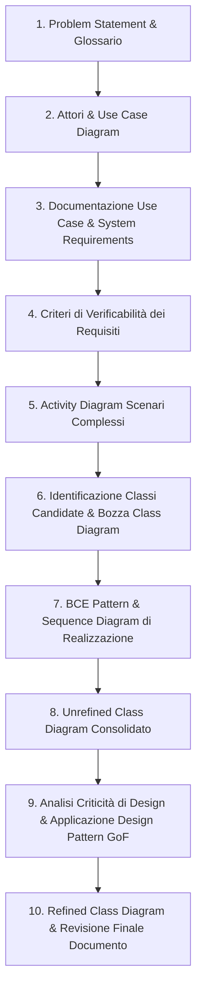
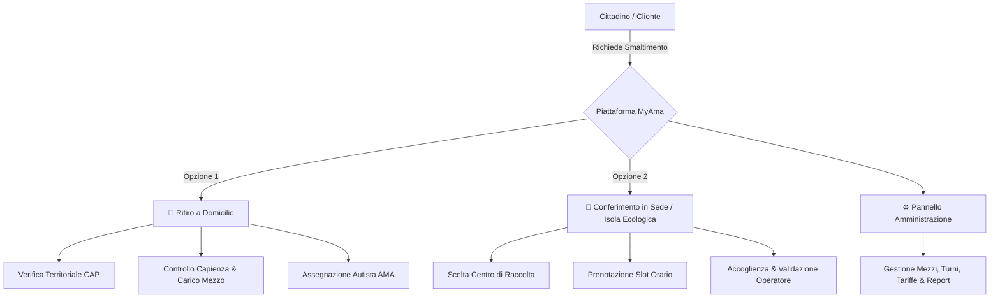

# 🚀 Progetto di Ingegneria del Software — *MyAma*

<div align="center">


</div>

---

## 📖 Panoramica del Progetto

Questa repository contiene tutto il materiale, la documentazione metodologica, i compendi teorici e gli esempi pratici per lo sviluppo del **Progetto d'Esame di Ingegneria del Software** (CdS in Informatica, Università degli Studi di Roma "Tor Vergata").

Il progetto è incentrato sull'ingegnerizzazione e specifica formale del sistema **`MyAma`**, una piattaforma digitale integrata per la **gestione, pianificazione e ottimizzazione delle prenotazioni per il ritiro e conferimento dei rifiuti urbani ingombranti e speciali** per la città di Roma.

---

## 🧭 Navigazione Rapida nei Documenti di Progetto

| Risorsa | Natura | Descrizione |
|---|---|---|
| 📂 **[`MYAMA/PROGETTOFINALE/`](./MYAMA/PROGETTOFINALE)** | **Specifica Consolidata** | **Cartella centrale del progetto d'esame**: contiene tutti i diagrammi (Use Case, Activity, Class), i requisiti di sistema, il glossario, la specifica Markdown e il progetto LaTeX compilabile ([`Latex PDF/`](./MYAMA/PROGETTOFINALE/Latex%20PDF)). |
| 📂 **[`MYAMA/GRUPPO 1/`](./MYAMA/GRUPPO%201)** | **Gruppo 1 Workspace** | Sequence Diagram ([`SEQUENCE DIAGRAM/`](./MYAMA/GRUPPO%201/SEQUENCE%20DIAGRAM)), bozze di metodi, messaggi e modelli Visual Paradigm. |
| 📂 **[`MYAMA/GRUPPO 2/`](./MYAMA/GRUPPO%202)** | **Gruppo 2 Workspace** | Area di lavoro per il secondo sottogruppo di sviluppo. |
| 💡 **[`idea.md`](./idea.md)** | **Visione Generale** | Riepilogo sintetico e intuitivo di MyAma (cittadini, sedi, ritiro a domicilio, conferimento) pensato per allineare rapidamente l'intero gruppo. |
| 🧠 **[`KNOWLEDGE/ideaprogetto.md`](./KNOWLEDGE/ideaprogetto.md)** | **Analisi di Dominio** | Analisi formale del problema (*problem statement*), attori, regole di business, servizi erogati e scenari di modellazione OOA. |
| 📘 **[`guide/guida-progetto.md`](./guide/guida-progetto.md)** | **Teoria & Modello Mentale** | Filo logico metodologico che spiega *perché* ogni passaggio serve (da Problem Statement a Use Case, Requisiti, Diagrammi dinamici/statici e Design Pattern). |
| 🚀 **[`guide/guida-operativa.md`](./guide/guida-operativa.md)** | **Guida Operativa** | Manuale pratico sequenziale di redazione della specifica (input/output di fase, decisioni da prendere e analisi delle parti parallelizzabili). |
| 👥 **[`guide/divisione-compiti.md`](./guide/divisione-compiti.md)** | **Organizzazione Team** | Piano organizzativo per i 5 componenti del gruppo (coppie, task condivisi, review incrociate e merge). |
| 📅 **[`guide/plan-giorni.md`](./guide/plan-giorni.md)** | **Roadmap & Planning** | Pianificazione cronologica delle attività e tappe di avanzamento del progetto. |
| 🛠️ **[`guide/guida-git.md`](./guide/guida-git.md)** | **Guida Collaboratori Git** | Manuale pratico Git & GitHub (inviti, setup, ciclo `pull`/`add`/`commit`/`push`, branch e gestione conflitti). |
| 📌 **[`guide/infoprof.md`](./guide/infoprof.md)** | **Linee Guida Docente** | Istruzioni ufficiali del Prof. Andrea D'Ambrogio: standard IEEE 830-1998, OOA, tool Visual Paradigm e scadenze d'esame. |
| 📚 **[`OTHER PROGETTI/`](./OTHER%20PROGETTI)** | **Benchmark Progetti** | Relazioni d'esame complete e modelli UML di riferimento (Pesca, Hotel TorVergata, RistorApp, Buongiorno, SteamPlatform). |
| ♻️ **[`PROGETTO DATA BASI/`](./PROGETTO%20DATA%20BASI)** | **Dominio Pregresso** | Documentazione e trascrizione integrale del progetto originale MyAma per il corso di Basi di Dati. |
| 📖 **[`TEORIA/`](./TEORIA)** | **Dispense Teoriche** | Compendi completi del corso di Ingegneria del Software (Vault Obsidian con schemi e figure). |
| 🌳 **[`tree.md`](./tree.md)** | **Mappa della Repository** | Indice dettagliato con descrizione sintetica *one-line* di ogni singola cartella, file e trascrizione. |

---

## 🔄 Il Flusso di Lavoro Metodologico (dall'Idea alla Specifica)

Come illustrato in [`guide/guida-progetto.md`](./guide/guida-progetto.md) e dettagliato in [`guide/guida-operativa.md`](./guide/guida-operativa.md), la redazione della specifica segue una sequenza rigorosa e incrementale:



---

## 💡 Il Dominio Applicativo: *MyAma*

Il sistema modella un servizio logistico distribuito e multi-attore:



### Ruoli & Attori Principali:
- **Cittadino (Cliente)**: Autenticazione (credenziali), richiesta di ritiro a domicilio o conferimento in sede, upload foto/dati rifiuto, verifica disponibilità e tracking stato prenotazione.
- **Autista AMA (Lavoratore)**: Consultazione ritiri assegnati per il proprio turno, registrazione esito del ritiro e contatto con il cittadino.
- **Operatore di Sede (Lavoratore)**: Consultazione prenotazioni del centro di raccolta, verifica prenotazione del cittadino e registrazione dell'esito dello scarico.
- **Amministratore di Sede AMA**: Gestione disponibilità lavoratori, disponibilità mezzi, fasce orarie della sede, associazioni CAP/zone e generazione codici invito per il personale.
- **Amministratore Generale AMA**: Gestione account degli Amministratori di sede (generazione codici invito e rimozione).

---

## 📚 Trascrizioni Integrali dei Progetti di Riferimento (`OTHER PROGETTI/`)

Per facilitare l'analisi testuale e il confronto pagina per pagina senza dipendere da lettori PDF binari, tutte le relazioni benchmark sono organizzate in sottocartelle dedicate dentro [`OTHER PROGETTI/`](./OTHER%20PROGETTI):

- 🐟 **[`OTHER PROGETTI/Progetto_Pesca_Cipolletta/Progetto_Cipolletta_Pesca.md`](./OTHER%20PROGETTI/Progetto_Pesca_Cipolletta/Progetto_Cipolletta_Pesca.md)** — Relazione completa (76 pagine) del progetto *Campionato di Pesca Sportiva*.
- 🏨 **[`OTHER PROGETTI/Progetto_Hotel_Mongelli/Progetto_Mongelli_Hotel.md`](./OTHER%20PROGETTI/Progetto_Hotel_Mongelli/Progetto_Mongelli_Hotel.md)** — Relazione completa (59 pagine) del progetto *Hotel TorVergata*.
- 🍽️ **[`OTHER PROGETTI/Progetto_RistorApp_Bianchini/Progetto_Bianchini_RistorApp.md`](./OTHER%20PROGETTI/Progetto_RistorApp_Bianchini/Progetto_Bianchini_RistorApp.md)** — Relazione completa (80 pagine) del progetto *RistorApp*.
- 🏋️ **[`OTHER PROGETTI/Progetto_Buongiorno_Machowski/Progetto_Buongiorno_Machowski_Muscillo_Politano.pdf`](./OTHER%20PROGETTI/Progetto_Buongiorno_Machowski/Progetto_Buongiorno_Machowski_Muscillo_Politano.pdf)** — Relazione PDF del progetto *Buongiorno* (riferimento primario di struttura).
- 🎮 **[`OTHER PROGETTI/SteamPlatform_Arbia,Di Iacovo, Malatesta, Marzi, Quartucci/ProgettoISW_25_26.pdf`](./OTHER%20PROGETTI/SteamPlatform_Arbia,Di%20Iacovo,%20Malatesta,%20Marzi,%20Quartucci/ProgettoISW_25_26.pdf)** — Relazione PDF e sorgenti del progetto *SteamPlatform*.
- ♻️ **[`PROGETTO DATA BASI/BASI_PROGETTO.md`](./PROGETTO%20DATA%20BASI/BASI_PROGETTO.md)** — Trascrizione della specifica iniziale di *MyAma* per Basi di Dati (30 pagine).

---

## 📁 Struttura della Repository

```text
PROGETTOISW/
├── 📄 README.md                                              # Presentazione generale del repository
├── 💡 idea.md                                                 # Idea sintetica del progetto per allineare il gruppo
├── 🌳 tree.md                                                # Mappa dettagliata e commentata dell'albero file
│
├── 📂 guide/                                                 # Guide metodologiche, operative e organizzative
│   ├── 🧭 guida-progetto.md                                   # Teoria orientata al progetto e modello mentale
│   ├── 🛠️ guida-operativa.md                                  # Guida operativa passo-passo per redigere la specifica
│   ├── 👥 divisione-compiti.md                                # Piano di divisione compiti per 5 persone
│   ├── 📅 plan-giorni.md                                      # Pianificazione cronologica e roadmap
│   ├── 🐙 guida-git.md                                        # Guida pratica Git/GitHub per i collaboratori
│   └── 👨‍🏫 infoprof.md                                        # Linee guida esame e scadenze del docente
│
├── 📂 KNOWLEDGE/                                             # Dominio di Business
│   └── 🧠 ideaprogetto.md                                     # Documento di visione, dominio e regole di business
│
├── 📂 MYAMA/                                                 # Cartella operativa di sviluppo del progetto d'esame
│   ├── 📂 GRUPPO 1/                                          # Workspace Gruppo 1: diagrammi di sequenza e modelli VP preliminari
│   │   └── 📂 SEQUENCE DIAGRAM/                              # Analisi di messaggi, metodi e chiamate sincrone/asincrone
│   ├── 📂 GRUPPO 2/                                          # Workspace Gruppo 2
│   └── 📂 PROGETTOFINALE/                                    # Cartella consolidata con tutti gli artefatti finali
│       ├── 📂 ACTIVITY DIAGRAM/                              # Modelli .vpp e immagini diagrammi di attività
│       ├── 📂 CLASS DIAGRAM/                                 # Class Diagram Unrefined (.vpp)
│       ├── 📂 INTRODUZIONE/                                  # Versioni e bozze della sezione introduttiva
│       ├── 📂 Latex PDF/                                     # Progetto LaTeX master per compilazione della relazione
│       ├── 📂 SYSTEM REQUIREMENTS/                           # Specifica formale dei requisiti di sistema
│       ├── 📂 USE CASE DIAGRAM/                              # Use Case, attori e User Requirements Definition
│       ├── 📄 glossario.md                                   # Glossario di dominio del sistema MyAma
│       └── 📄 specifica_MyAma.md                             # Specifica integrata in formato Markdown
│
├── 📂 PROGETTO DATA BASI/                                    # Progetto pregresso di Basi di Dati (fonte di dominio)
│   ├── 📄 BASI_PROGETTO.md                                   # Trascrizione Markdown integrale
│   └── 📄 BASI PROGETTO.pdf                                  # Documento PDF originale (30 pag.)
│
├── 📂 OTHER PROGETTI/                                        # Benchmark e progetti d'esame completi di riferimento
│   ├── 📂 Progetto_Pesca_Cipolletta/                         # Progetto "Campionato Pesca Sportiva"
│   ├── 📂 Progetto_Hotel_Mongelli/                           # Progetto "Hotel TorVergata"
│   ├── 📂 Progetto_RistorApp_Bianchini/                      # Progetto "RistorApp"
│   ├── 📂 Progetto_Buongiorno_Machowski/                     # Progetto "Buongiorno" (Benchmark primario)
│   └── 📂 SteamPlatform_Arbia.../                            # Progetto "SteamPlatform"
│
└── 📂 TEORIA/                                                # Compendi teorici completi in formato Obsidian Vault
    ├── 📂 ISW_obsidian_full/                                 # Dispensa generale di Ingegneria del Software
    └── 📂 IS_andrea_obsidian_full/                           # Dispensa completa del corso
```

---

## 🎯 Deliverable di Progetto e Requisiti d'Esame

In conformità con quanto richiesto dal **Prof. Andrea D'Ambrogio**:

1. **Documento di Specifica Software (SRS)**:
   - Redatto secondo il template standard **IEEE 830-1998** (disponibile nel progetto LaTeX [`MYAMA/PROGETTOFINALE/Latex PDF/`](./MYAMA/PROGETTOFINALE/Latex%20PDF)).
   - Capitolo 1: *Introduzione & Problem Statement*.
   - Capitolo 2: *Glossario dei termini*.
   - Capitolo 3: *User Requirements Definition* (Use Cases con diagrammi e schede descrittive per ogni attore).
   - Capitolo 4: *System Requirements* (Requisiti Funzionali, Non Funzionali e di Dominio).
   - Capitolo 5: *Specifica OOA (Object Oriented Analysis)* con Activity Diagrams, Sequence Diagrams (BCE) e **Unrefined Class Diagram**.
2. **Appendice Progettazione con Design Pattern**:
   - Applicazione formale di almeno **2 Design Pattern** (es. *Strategy*, *State*, *Factory Method*, *Observer*).
   - Evoluzione da *Unrefined Class Diagram* a **Refined Class Diagram** (con classi del pattern, metodi, tipi e visibilità).
3. **Modelli UML Sorgente**:
   - Tutti i diagrammi realizzati e salvati in formato **Visual Paradigm** (`.vpp`).
4. **Modalità di Consegna**:
   - Invio della relazione PDF finale e dell'archivio `.vpp` via email a `dambro@uniroma2.it` almeno **5 giorni lavorativi prima dell'appello d'esame**.

---

<div align="center">
  <sub>Università degli Studi di Roma "Tor Vergata" • Corso di Laurea in Informatica</sub>
</div>
