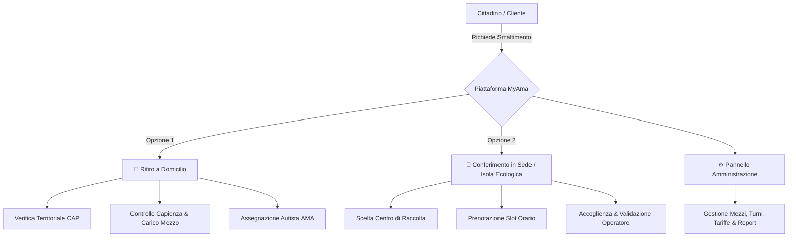

# 🚀 Progetto di Ingegneria del Software — *MyAma*

<div align="center">


</div>

---

## 📖 Panoramica del Progetto

Questa repository contiene tutto il materiale, la documentazione metodologica, i compendi teorici e gli esempi pratici per lo sviluppo del **Progetto d'Esame di Ingegneria del Software** (CdS in Informatica, Università degli Studi di Roma "Tor Vergata").

Il progetto è incentrato sull'ingegnerizzazione e specifica formale del sistema **`MyAma`**, una piattaforma digitale integrata per la **gestione, pianificazione e ottimizzazione delle prenotazioni per il ritiro e conferimento dei rifiuti urbani ingombranti e speciali** per la città di Roma.

---

## 🧭 Navigazione Rapida nei Documenti di Progetto

| Documento | Descrizione |
|---|---|
| 💡 **[`ideaprogetto.md`](./ideaprogetto.md)** | **Visione, Dominio e Idea Progettuale**: analisi del problema (*problem statement*), attori coinvolti, servizi erogati, regole di business e opportunità di applicazione dei Design Pattern. |
| 📌 **[`infoprof.md`](./infoprof.md)** | **Istruzioni Ufficiali & Guida Esame**: requisiti formali del docente (IEEE 830-1998, OOA, Visual Paradigm, appendice Design Pattern) e scadenze di consegna. |
| 🌳 **[`tree.md`](./tree.md)** | **Mappa della Repository**: indice dettagliato con descrizione sintetica *one-line* di ogni singola cartella, file e trascrizione. |

---

## 📚 Trascrizioni Integrali dei Progetti di Riferimento (Consultabili in Markdown)

Per facilitare l'analisi testuale e il confronto pagina per pagina senza dipendere da lettori PDF binari, tutte le relazioni sono disponibili in formato `.md`:

- 🐟 **[`ALTRI/Progetto_Cipolletta_Pesca.md`](./ALTRI/Progetto_Cipolletta_Pesca.md)** — Relazione completa (76 pagine) del progetto *Campionato di Pesca Sportiva*.
- 🏨 **[`ALTRI/Progetto_Mongelli_Hotel.md`](./ALTRI/Progetto_Mongelli_Hotel.md)** — Relazione completa (59 pagine) del progetto *Hotel TorVergata*.
- 🍽️ **[`ALTRI/Progetto_Bianchini_RistorApp.md`](./ALTRI/Progetto_Bianchini_RistorApp.md)** — Relazione completa (80 pagine) del progetto *RistorApp*.
- ♻️ **[`MYAMABASIDATI/BASI_PROGETTO.md`](./MYAMABASIDATI/BASI_PROGETTO.md)** — Trascrizione della specifica iniziale di *MyAma* per Basi di Dati (30 pagine).

---

## 📁 Struttura della Repository

```text
PROGETTOISW/
├── 📄 README.md                                              # Presentazione generale del repository
├── 📄 ideaprogetto.md                                         # Documento di visione e dominio MyAma
├── 📄 infoprof.md                                            # Linee guida esame e scadenze del docente
├── 📄 tree.md                                                # Mappa dettagliata e commentata dell'albero file
│
├── 📂 MYAMABASIDATI/                                         # Progetto pregresso di Basi di Dati (fonte di dominio)
│   ├── 📝 BASI_PROGETTO.md                                   # Trascrizione Markdown integrale pagina per pagina
│   └── 📄 BASI PROGETTO.pdf                                  # PDF originale (30 pag.)
│
├── 📂 ALTRI/                                                 # Benchmark e progetti d'esame completi di riferimento
│   ├── 📝 Progetto_Cipolletta_Pesca.md                       # Trascrizione Markdown completa (76 pag.)
│   ├── 📝 Progetto_Mongelli_Hotel.md                         # Trascrizione Markdown completa (59 pag.)
│   ├── 📝 Progetto_Bianchini_RistorApp.md                    # Trascrizione Markdown completa (80 pag.)
│   ├── 📂 FileProgetto/                                      # Modelli Visual Paradigm (.vpp) estratti "Hotel"
│   ├── 📂 Progetto_Bianchini_Corsetti_Mazzenga/              # Relazione PDF + sorgenti .vpp estratti "RistorApp"
│   ├── 📄 Progetto_Cipolletta_Noce_Salvucci_Sfeir.pdf        # PDF originale "Pesca"
│   └── 📄 Progetto_Mongelli_Pace_Rossi_Sandu.pdf             # PDF originale "Hotel"
│
└── 📂 TEORIA/                                                # Compendi teorici completi in formato Obsidian Vault
    ├── 📂 ISW_obsidian_full/                                 # Dispensa generale di Ingegneria del Software (178 figure)
    └── 📂 IS_andrea_obsidian_full/                           # Dispensa completa del corso di Andrea (50 figure)
```

---

## 💡 Il Dominio Applicativo: *MyAma*

Il sistema modella un servizio logistico distribuito e multi-attore:



### Ruoli & Attori Principali:
- **Cittadino (Cliente)**: Autenticazione (credenziali / SPID), invio richiesta con geolocalizzazione e upload foto rifiuto, preventivo, tracking stato, recensione post-servizio.
- **Autista AMA (Lavoratore)**: Consultazione itinerario, gestione capienza veicolo ($\sum \text{Pesi} \le \text{CaricoMax}$), registrazione esito ritiro.
- **Operatore di Sede (Lavoratore)**: Gestione varchi centri di raccolta, verifica conformità rifiuto e convalida scarico.
- **Amministratore / Logistica**: Gestione sedi, associazione zone/CAP, anagrafica mezzi, turnazione e tariffari.

---

## 🎯 Deliverable di Progetto e Requisiti d'Esame

In conformità con quanto richiesto dal **Prof. Andrea D'Ambrogio**:

1. **Documento di Specifica Software (SRS)**:
   - Redatto secondo il template standard **IEEE 830-1998**.
   - Capitolo 1: *Introduzione & Problem Statement*.
   - Capitolo 2: *Glossario dei termini*.
   - Capitolo 3: *User Requirements Definition* (Funzionali, Non Funzionali e di Dominio).
   - Capitolo 4: *Verificabilità dei Requisiti* (criteri di accettazione e testabilità).
   - Capitolo 5: *Specifica OOA (Object Oriented Analysis)* con Use Case Diagrams, schede descrittive, Sequence Diagrams, State Diagrams e **Unrefined Class Diagram**.
2. **Appendice Progettazione con Design Pattern**:
   - Applicazione formale di almeno **2 Design Pattern** (es. *Strategy*, *State*, *Factory Method*, *Observer*).
   - Evoluzione da *Unrefined Class Diagram* a **Refined Class Diagram** (con classi del pattern, metodi, tipi e visibilità).
3. **Modelli UML Sorgente**:
   - Tutti i diagrammi realizzati e salvati in formato **Visual Paradigm** (`.vpp`).
4. **Modalità di Consegna**:
   - Invio della relazione PDF finale e dell'archivio `.vpp` via email a `dambro@uniroma2.it` almeno **5 giorni lavorativi prima dell'appello d'esame**.

---

<div align="center">
  <sub>Università degli Studi di Roma "Tor Vergata" • Corso di Laurea in Informatica</sub>
</div>
